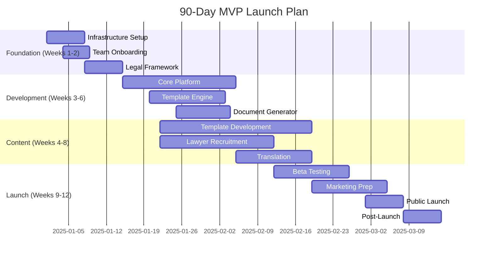

# LegalMind — 90-Day Launch Checklist
## MVP Launch Roadmap (Startup Legal Stack)

**Version:** 2.0
**Last Updated:** 2025-10-14
**Goal:** Launch LegalMind MVP with 3-5 jurisdictions, 20 templates, verified lawyers, and first paying customers

---

## 📅 Launch Timeline Overview

---

## Week 1-2: Foundation (Days 1-14)

### 🎯 Goal: Infrastructure, team, and legal foundation in place

### Day 1-3: Company Setup & Infrastructure
- [ ] **Incorporate LegalMind** (UK Ltd or US-DE Inc) ⏱️ 1 day
  - Company name registration
  - Bank account setup
  - Accounting software (Xero/QuickBooks)

- [ ] **Set up development infrastructure** ⏱️ 2 days
  - AWS/GCP accounts (EU + US regions)
  - Vercel account for frontend hosting
  - GitHub organization + repositories
  - CI/CD pipelines (GitHub Actions)
  - Staging + production environments

- [ ] **Domain & branding** ⏱️ 1 day
  - Register legalmind.com (or variant)
  - SSL certificates (Let's Encrypt)
  - Logo design (Figma/Canva)
  - Brand guidelines (colors, fonts)

### Day 4-7: Team Onboarding
- [ ] **Hire core team** (if not already in place) ⏱️ Ongoing
  - [ ] Technical Lead / Full-stack developer
  - [ ] Legal Content Manager / Head of Legal Ops
  - [ ] UI/UX Designer
  - [ ] Marketing / Growth Lead (Week 8)

- [ ] **Team setup** ⏱️ 2 days
  - Access to all tools (GitHub, AWS, Figma, Notion)
  - Project management setup (Linear/Jira/Notion)
  - Communication tools (Slack, Discord)
  - Documentation wiki (Notion/Confluence)

- [ ] **Kick-off meeting** ⏱️ 0.5 days
  - Review architecture docs
  - Assign ownership (engineering, legal, design)
  - Set up daily standups

### Day 8-14: Legal & Compliance Foundation
- [ ] **Obtain legal opinion on UPL risk** ⏱️ 5 days
  - Engage law firm in UK, US, DE
  - Review: Is document generation UPL?
  - Draft terms of service disclaimers
  - Cost: €5K-10K

- [ ] **Draft core legal documents** ⏱️ 3 days
  - [ ] Terms of Service
  - [ ] Privacy Policy (GDPR-compliant)
  - [ ] Cookie Policy
  - [ ] Disclaimer Language (pre-generation modal)
  - [ ] Lawyer Contributor Agreement
  - [ ] Lawyer Terms of Service (referrals)

- [ ] **GDPR compliance setup** ⏱️ 2 days
  - Data Processing Register
  - Cookie consent mechanism (Cookiebot/OneTrust)
  - User data retention policies
  - Right to erasure workflow

**✅ Week 2 Milestone:** Infrastructure live, team onboarded, legal foundation set

---

## Week 3-4: Core Platform Development (Days 15-28)

### 🎯 Goal: Authentication, database, and API foundation

### Backend Development ⏱️ 10 days
- [ ] **Set up NestJS project** ⏱️ 1 day
  - Project scaffolding
  - Environment configuration
  - Linting + formatting (ESLint, Prettier)

- [ ] **Database setup (PostgreSQL)** ⏱️ 2 days
  - RDS instance (AWS) or managed PostgreSQL
  - Initial schema migration (see DATABASE_SCHEMA_V2.md)
  - Seed jurisdictions and languages
  - Connection pooling (PgBouncer)

- [ ] **Authentication system (Clerk)** ⏱️ 2 days
  - Clerk project setup
  - User signup/login flows
  - JWT validation middleware
  - Role-based access control (RBAC)
  - SSO ready (future: Google, GitHub)

- [ ] **Core API endpoints** ⏱️ 3 days
  - [ ] User CRUD (profile, preferences)
  - [ ] Template listing (with filters)
  - [ ] Template details
  - [ ] Jurisdiction/language data
  - [ ] Health check + metrics

- [ ] **API documentation (Swagger)** ⏱️ 1 day
  - OpenAPI 3.1 spec auto-generation
  - Swagger UI hosted at `/api/docs`

- [ ] **Testing setup** ⏱️ 1 day
  - Jest for unit tests
  - Supertest for integration tests
  - Test database setup

### Frontend Development ⏱️ 8 days
- [ ] **Next.js 14 setup** ⏱️ 1 day
  - Project scaffolding (App Router)
  - TypeScript configuration
  - Tailwind CSS + Headless UI
  - next-intl for i18n

- [ ] **Core pages** ⏱️ 4 days
  - [ ] Homepage (hero + template library)
  - [ ] Template listing (with search/filters)
  - [ ] Template detail page
  - [ ] User dashboard (saved documents)
  - [ ] Lawyer profile page
  - [ ] Signup/login flows (Clerk)

- [ ] **Component library** ⏱️ 2 days
  - [ ] Header/Footer
  - [ ] Template card
  - [ ] Search filters
  - [ ] Loading states
  - [ ] Error boundaries

- [ ] **State management (Zustand)** ⏱️ 1 day
  - User state
  - Cart/session state
  - Template filters

**✅ Week 4 Milestone:** Core platform functional (auth, templates visible)

---

## Week 5-6: Template Engine & Document Generation (Days 29-42)

### 🎯 Goal: Document generation pipeline operational

### Template Engine (Python FastAPI) ⏱️ 7 days
- [ ] **Python microservice setup** ⏱️ 1 day
  - FastAPI project structure
  - Docker containerization
  - Deploy to AWS ECS / Cloud Run

- [ ] **JSONLogic rule engine** ⏱️ 2 days
  - Conditional clause evaluation
  - Variable validation (Pydantic)
  - Rule testing framework

- [ ] **Jinja2 templating** ⏱️ 2 days
  - Template rendering
  - Variable interpolation
  - Clause inclusion/exclusion logic
  - Error handling (missing variables)

- [ ] **Template API endpoints** ⏱️ 1 day
  - [ ] GET /templates/:id/schema (questionnaire)
  - [ ] POST /templates/:id/validate (answers)
  - [ ] POST /templates/:id/render (preview)

- [ ] **Testing** ⏱️ 1 day
  - Unit tests (pytest)
  - Integration tests with sample templates

### Document Generator (Async Queue) ⏱️ 7 days
- [ ] **BullMQ setup (Redis queue)** ⏱️ 1 day
  - Redis instance (ElastiCache or local)
  - Queue configuration
  - Worker processes

- [ ] **DOCX generation** ⏱️ 3 days
  - docxtemplater integration
  - Styling (fonts, headings, margins)
  - Complex formatting (tables, lists)
  - Output to S3

- [ ] **PDF generation** ⏱️ 2 days
  - Puppeteer setup
  - HTML → PDF rendering
  - Watermarking (if draft)
  - Output to S3

- [ ] **Generation workflow** ⏱️ 1 day
  - Job creation (user submits answers)
  - Progress tracking (websocket or polling)
  - Completion notification (email)
  - Download link generation (signed S3 URLs)

### Questionnaire UI ⏱️ 4 days
- [ ] **Multi-step form** ⏱️ 2 days
  - React Hook Form integration
  - Zod validation schema
  - Progress bar
  - Auto-save to localStorage

- [ ] **Disclaimer modal** ⏱️ 1 day
  - Pre-generation warning
  - "Not legal advice" checkbox
  - Lawyer referral CTA

- [ ] **Document preview** ⏱️ 1 day
  - Live preview as user answers
  - Variable highlighting
  - Explanation tooltips

**✅ Week 6 Milestone:** Can generate and download DOCX/PDF documents

---

## Week 7-8: Template Content & Lawyer Network (Days 43-56)

### 🎯 Goal: 20 templates drafted, 10-15 lawyers recruited

### Template Development ⏱️ 14 days (parallel)
- [ ] **Recruit 3-5 lawyer contributors per jurisdiction** ⏱️ Ongoing
  - LinkedIn outreach (50 lawyers)
  - Pitch deck + contributor agreement
  - Target: 15 lawyers signed by Week 7

- [ ] **Draft 20 core templates** ⏱️ 12 days
  **UK (5 templates)**
  - [ ] Founders' Agreement
  - [ ] Employment Contract
  - [ ] NDA (Mutual)
  - [ ] SAFE (YC adapted for UK)
  - [ ] Privacy Policy

  **US-DE (5 templates)**
  - [ ] Founders' Agreement (Delaware)
  - [ ] Employment Contract (at-will)
  - [ ] NDA (Mutual)
  - [ ] SAFE (YC standard)
  - [ ] Stock Option Grant (ISO)

  **Germany (5 templates)**
  - [ ] Gesellschaftsvertrag (GmbH Founders)
  - [ ] Arbeitsvertrag (Employment)
  - [ ] NDA (Mutual, German)
  - [ ] DPA (GDPR)
  - [ ] AGB (Terms & Conditions)

  **France (3 templates)**
  - [ ] Pacte d'actionnaires (Shareholders)
  - [ ] Contrat de travail (Employment)
  - [ ] NDA (Mutual, French)

  **Spain (2 templates)**
  - [ ] Pacto de socios (Shareholders)
  - [ ] Contrato de trabajo (Employment)

- [ ] **Lawyer review (2 rounds per template)** ⏱️ 4 days
  - Round 1: Draft review + feedback
  - Round 2: Revised review + approval
  - Sign-off by jurisdiction-licensed lawyer

- [ ] **Variable extraction & JSONLogic rules** ⏱️ 3 days
  - Identify all variables (20-30 per template)
  - Define validation rules
  - Write conditional clauses
  - Test all logic paths

- [ ] **Translation (German, French, Spanish)** ⏱️ 5 days
  - Hire legal translators (Upwork, ProZ)
  - Translate template content
  - Lawyer review of translations
  - Cost: €500-1,000 per template

### Lawyer Network Setup ⏱️ 5 days
- [ ] **Lawyer CMS portal** ⏱️ 3 days
  - Profile creation/editing
  - Referral inbox
  - Revenue dashboard
  - Payout management

- [ ] **Verification workflow** ⏱️ 2 days
  - Document upload (bar certificate, ID)
  - Admin review interface
  - Approval/rejection flow
  - Verification badge display

**✅ Week 8 Milestone:** 20 templates approved, 15 lawyers verified, ready for beta

---

## Week 9-10: Payment & Billing (Days 57-70)

### 🎯 Goal: Stripe integration, subscription management

### Stripe Integration ⏱️ 7 days
- [ ] **Stripe account setup** ⏱️ 1 day
  - Company verification
  - Bank account connection
  - Tax settings (EU VAT)

- [ ] **Subscription products** ⏱️ 1 day
  - Free tier (3 docs/mo)
  - Starter (€19/mo, 5 docs)
  - Pro (€49/mo, unlimited)
  - Scale (€99/mo, white-label)

- [ ] **Checkout flow** ⏱️ 2 days
  - Stripe Checkout integration
  - Subscription creation
  - Payment confirmation page
  - Invoice generation

- [ ] **Webhook handling** ⏱️ 2 days
  - `checkout.session.completed`
  - `invoice.payment_succeeded`
  - `invoice.payment_failed`
  - `customer.subscription.deleted`
  - Webhook verification (signature)

- [ ] **Billing dashboard** ⏱️ 1 day
  - Current plan display
  - Usage metrics (documents generated)
  - Upgrade/downgrade CTA
  - Invoice history

### Referral Revenue Tracking ⏱️ 3 days
- [ ] **Referral tracking system** ⏱️ 2 days
  - Unique referral codes
  - Status tracking (initiated → completed)
  - Engagement value input (lawyer reports)
  - Revenue calculation (15-25%)

- [ ] **Lawyer payout system** ⏱️ 1 day
  - Payout request workflow
  - Stripe Connect for payouts
  - Payout history

**✅ Week 10 Milestone:** Payments functional, subscriptions work end-to-end

---

## Week 11: Beta Testing (Days 71-77)

### 🎯 Goal: Test with 30-50 real founders, identify bugs

### Beta Program Setup ⏱️ 2 days
- [ ] **Beta signup form** ⏱️ 0.5 days
  - Typeform or Google Form
  - Collect founder details (name, startup, jurisdiction)
  - Selection criteria (target jurisdictions)

- [ ] **Recruit 50 beta users** ⏱️ 1.5 days
  - Outreach to accelerators (YC, Techstars)
  - LinkedIn/Twitter outreach
  - ProductHunt "coming soon" page
  - Indie Hackers, Reddit r/startups

- [ ] **Beta onboarding** ⏱️ 0.5 days
  - Welcome email with instructions
  - Loom video walkthrough
  - Private Slack channel for feedback

### Testing & Iteration ⏱️ 5 days
- [ ] **Monitor usage** ⏱️ Ongoing
  - Analytics (PostHog, Mixpanel)
  - Error tracking (Sentry)
  - User session recordings (FullStory)

- [ ] **Collect feedback** ⏱️ 3 days
  - Post-generation survey (NPS, qualitative)
  - 1-on-1 user interviews (10 founders)
  - Feedback categorization (bugs, UX, content)

- [ ] **Bug fixes & iterations** ⏱️ 2 days
  - Critical bugs (blocking document generation)
  - UX improvements (confusing flows)
  - Template corrections (legal issues)
  - Performance optimizations

**✅ Week 11 Milestone:** Beta tested, critical bugs fixed, ready for public launch

---

## Week 12: Launch Prep & Go-Live (Days 78-90)

### 🎯 Goal: Public launch with marketing, press, and first paying customers

### Marketing & Content ⏱️ 5 days
- [ ] **Launch website content** ⏱️ 2 days
  - Homepage copy (value prop, social proof)
  - Template library descriptions
  - Lawyer marketplace page
  - Pricing page
  - FAQ page
  - Blog (3-5 articles on startup legal topics)

- [ ] **SEO optimization** ⏱️ 1 day
  - Keyword research (founders agreement, SAFE template, etc.)
  - Meta tags, descriptions
  - Sitemap.xml
  - Google Search Console setup

- [ ] **Launch assets** ⏱️ 2 days
  - Product demo video (2-3 min)
  - Screenshots for launch posts
  - Press kit (logo, description, founder bios)
  - Case studies from beta (with permission)

### Launch Campaigns ⏱️ 3 days
- [ ] **ProductHunt launch** ⏱️ 1 day
  - Schedule launch (Tuesday-Thursday best)
  - Hunter outreach (influencer to hunt)
  - Prepare comments + responses
  - Upvote campaign (team, beta users)

- [ ] **Hacker News (Show HN)** ⏱️ 0.5 days
  - Draft Show HN post (authentic founder story)
  - Post timing (morning US time)
  - Monitor comments, respond promptly

- [ ] **Social media** ⏱️ 1 day
  - Twitter launch thread
  - LinkedIn post (founder + company pages)
  - Reddit posts (r/startups, r/entrepreneur, r/SideProject)
  - Indie Hackers launch post

- [ ] **PR outreach** ⏱️ 0.5 days
  - Email to TechCrunch, VentureBeat, The Verge
  - Legaltech publications (Above the Law, Legal Geek)
  - Accelerator newsletters

### Launch Day (Day 85) 🚀
- [ ] **Go-live checklist** ⏱️ 1 day
  - [ ] Remove beta-only restrictions
  - [ ] Enable public signup
  - [ ] Payment flows active
  - [ ] All templates published
  - [ ] Lawyer profiles live
  - [ ] Monitoring dashboards ready
  - [ ] Support email ready (support@legalmind.com)

- [ ] **Launch execution** ⏱️ Full day
  - 8am: ProductHunt goes live
  - 9am: Social media posts
  - 10am: Show HN post
  - 11am: Email to beta users (thank you + share)
  - All day: Monitor, respond to comments, fix issues

### Post-Launch (Days 86-90) ⏱️ 5 days
- [ ] **Monitor metrics** ⏱️ Ongoing
  - Signups, conversions, churn
  - Document generation success rate
  - Lawyer referrals initiated
  - Revenue (MRR growth)

- [ ] **Customer support** ⏱️ Ongoing
  - Respond to support emails (<4 hours)
  - In-app chat support (Intercom/Crisp)
  - Bug triage and hotfixes

- [ ] **Iteration** ⏱️ 3 days
  - Top 5 user-requested features
  - Top 5 most-used templates (expand these)
  - UX improvements based on analytics

- [ ] **Celebrate! 🎉** ⏱️ 1 day
  - Team dinner/drinks
  - Review what went well, what didn't
  - Plan next 90 days (Phase 2 jurisdictions)

**✅ Day 90 Milestone:** Public launch complete, first paying customers, product-market fit validated

---

## Budget Breakdown (90 Days)

### One-Time Costs
| Item | Cost | Notes |
|------|------|-------|
| Company incorporation | €500 | UK Ltd or US-DE Inc |
| Legal opinions (UPL) | €10,000 | UK, US, DE lawyers |
| Logo & branding | €1,000 | Designer or Fiverr |
| Domain + SSL | €100 | Annual domain |
| **Total One-Time** | **€11,600** | |

### Monthly Recurring Costs (Month 3)
| Item | Cost | Notes |
|------|------|-------|
| **Team Salaries** | €30,000 | 2 FTE × €15K/mo (fractional or full-time) |
| **Freelancers** | €5,000 | Translators, designers |
| **Infrastructure** | €500 | AWS, Vercel, Clerk, Stripe, etc. |
| **Legal Contributors** | €15,000 | 20 templates × €750 avg |
| **Tools & Software** | €500 | Figma, Notion, analytics, etc. |
| **Marketing** | €2,000 | ProductHunt, ads (optional) |
| **Total Monthly** | **€53,000** | |

### 90-Day Total Budget
**€11,600 (one-time) + €53,000 × 3 months = ~€170K**

**Funding Needs:** €150K-200K (pre-seed or bootstrapped)

---

## Success Metrics (Day 90 Targets)

| Metric | Target | Stretch Goal |
|--------|--------|--------------|
| **Signups** | 500 | 1,000 |
| **Paying Customers** | 50 | 100 |
| **MRR** | €2,000 | €5,000 |
| **Documents Generated** | 1,000 | 2,500 |
| **Verified Lawyers** | 15 | 25 |
| **Lawyer Referrals** | 20 | 50 |
| **NPS Score** | 50+ | 70+ |
| **Template Completion Rate** | 70% | 85% |

---

## Risk Register & Mitigation

| Risk | Probability | Impact | Mitigation |
|------|-------------|--------|------------|
| **Lawyer recruitment delays** | High | High | Start recruitment Week 1, offer higher fees |
| **Template quality issues** | Medium | High | 2-round lawyer review, beta testing |
| **Technical bugs at launch** | Medium | Medium | Comprehensive testing, beta program |
| **Low founder adoption** | Medium | High | Accelerator partnerships, free tier |
| **UPL regulatory challenge** | Low | Very High | Legal opinion pre-launch, clear disclaimers |
| **Payment fraud** | Low | Medium | Stripe Radar, KYC for high-value |

---

## Team Roles & Responsibilities

### Founder / CEO
- Product vision & strategy
- Fundraising (if applicable)
- Lawyer partnerships & recruitment
- PR & external communications

### Technical Lead / CTO
- Architecture & infrastructure
- Backend development (NestJS)
- Document generation pipeline
- DevOps & deployment

### Frontend Developer
- Next.js frontend
- UI/UX implementation
- Component library
- Mobile responsiveness

### Legal Content Manager
- Template development oversight
- Lawyer contributor management
- Quality assurance (legal accuracy)
- Translation coordination

### Designer (Contract/Freelance)
- UI/UX design (Figma)
- Brand assets
- Marketing materials

### Marketing Lead (Week 8+)
- Launch campaigns
- Content marketing
- SEO & growth
- Community management

---

## Daily Standup Agenda (15 min)

1. **What did you accomplish yesterday?**
2. **What are you working on today?**
3. **Any blockers?**
4. **Launch countdown update** (days remaining)

---

## Weekly Review Agenda (1 hour, Friday)

1. **Metrics review** (signups, templates, lawyers)
2. **Sprint retrospective** (what went well, what didn't)
3. **Next week priorities** (top 3 per person)
4. **Risk review** (any new risks?)
5. **Demo** (show what shipped this week)

---

## Go/No-Go Launch Decision (Day 84)

### Go Criteria (All must be YES)
- [ ] **20 templates live** and lawyer-approved
- [ ] **Document generation works** (DOCX + PDF)
- [ ] **Payment flow functional** (Stripe checkout)
- [ ] **No critical bugs** (P0 bugs = 0)
- [ ] **Legal disclaimers** present and prominent
- [ ] **10+ lawyers verified** and accepting referrals
- [ ] **Beta feedback addressed** (top 5 issues fixed)
- [ ] **Support infrastructure ready** (email, docs, chat)

### No-Go Triggers
- Critical legal issue (UPL risk)
- Payment system not functional
- Major security vulnerability
- <5 lawyers verified

**If No-Go:** Delay launch 1 week, fix blockers, re-assess

---

## Post-Launch: Days 91-180 (Next 90 Days)

### Goals
1. **Product-market fit validation** (retention, NPS, revenue growth)
2. **Expand to 10 jurisdictions** (Phase 2 rollout)
3. **Grow to 3K users, €20K MRR**
4. **Hire 2-3 additional team members** (engineering, legal ops)
5. **Raise seed round** (€500K-1M) if applicable

---

## Conclusion

This 90-day launch checklist provides a **realistic, actionable roadmap** to take LegalMind from concept to live product with paying customers. By focusing on:

1. **Quality over quantity** (20 great templates, not 50 mediocre ones)
2. **Lawyer validation** (every template reviewed by qualified lawyers)
3. **Founder testing** (beta program with 50 real users)
4. **Execution speed** (ship fast, iterate faster)

...you can successfully launch a startup legal platform that founders love and lawyers trust.

**Next Steps:**
1. **Secure funding** (€150K-200K pre-seed or bootstrap)
2. **Recruit team** (2-3 people for Week 1)
3. **Start lawyer outreach** (target 20 lawyers by Week 4)
4. **Execute this checklist** day by day, week by week

🚀 **Let's build the future of startup legal!**

---

**Document Owner:** Founder / CEO
**Review Cycle:** Weekly during 90-day sprint
**Version Control:** Git-tracked + daily progress updates
