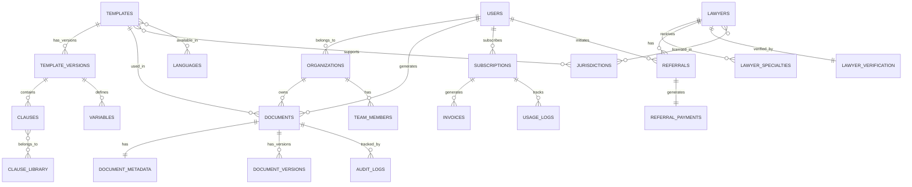

# LegalMind — Database Schema V2
## Startup Legal Stack ERD & Data Dictionary

**Version:** 2.0 (Startup Focus)
**Database:** PostgreSQL 15+
**Last Updated:** 2025-10-14

---

## 1. Entity Relationship Diagram



---

## 2. Core Tables

### 2.1 users
**Purpose:** User accounts (founders, lawyers, admins)

| Column | Type | Constraints | Description |
|--------|------|-------------|-------------|
| id | UUID | PK, Default gen_random_uuid() | Primary key |
| clerk_user_id | VARCHAR(255) | UNIQUE, NOT NULL | Clerk authentication ID |
| email | VARCHAR(320) | UNIQUE, NOT NULL | User email |
| full_name | VARCHAR(255) | NOT NULL | Full name |
| role | ENUM | NOT NULL | 'founder', 'lawyer', 'admin' |
| organization_id | UUID | FK → organizations | User's organization |
| language_preference | VARCHAR(10) | Default 'en-US' | UI language |
| jurisdiction_preference | VARCHAR(20) | | Primary jurisdiction |
| onboarding_completed | BOOLEAN | Default FALSE | Onboarding status |
| email_verified | BOOLEAN | Default FALSE | Email verification |
| last_active_at | TIMESTAMP | | Last activity timestamp |
| created_at | TIMESTAMP | Default NOW() | Account creation |
| updated_at | TIMESTAMP | Default NOW() | Last update |
| deleted_at | TIMESTAMP | NULL | Soft delete |

**Indexes:**
- `idx_users_email` (email)
- `idx_users_clerk_id` (clerk_user_id)
- `idx_users_organization` (organization_id)
- `idx_users_role` (role)

---

### 2.2 organizations
**Purpose:** Company/team accounts (for B2B)

| Column | Type | Constraints | Description |
|--------|------|-------------|-------------|
| id | UUID | PK | Primary key |
| name | VARCHAR(255) | NOT NULL | Company name |
| slug | VARCHAR(100) | UNIQUE, NOT NULL | URL-safe identifier |
| type | ENUM | NOT NULL | 'startup', 'accelerator', 'vc', 'law_firm' |
| jurisdiction | VARCHAR(20) | NOT NULL | Primary jurisdiction |
| incorporation_number | VARCHAR(100) | | Company registration |
| vat_number | VARCHAR(50) | | EU VAT number |
| billing_email | VARCHAR(320) | | Billing contact |
| logo_url | TEXT | | Company logo |
| seat_count | INTEGER | Default 1 | Licensed seats |
| plan_tier | ENUM | NOT NULL | 'starter', 'pro', 'scale' |
| created_at | TIMESTAMP | Default NOW() | |
| updated_at | TIMESTAMP | Default NOW() | |

**Indexes:**
- `idx_org_slug` (slug)
- `idx_org_jurisdiction` (jurisdiction)

---

### 2.3 templates
**Purpose:** Legal document templates (master table)

| Column | Type | Constraints | Description |
|--------|------|-------------|-------------|
| id | UUID | PK | Primary key |
| code | VARCHAR(100) | UNIQUE, NOT NULL | Machine-readable code |
| title | VARCHAR(255) | NOT NULL | Template name |
| description | TEXT | NOT NULL | Template description |
| category | ENUM | NOT NULL | See categories below |
| subcategory | VARCHAR(100) | | Subcategory tag |
| complexity_score | INTEGER | 1-10 | Complexity rating |
| estimated_time_minutes | INTEGER | | Completion time estimate |
| is_published | BOOLEAN | Default FALSE | Publication status |
| is_premium | BOOLEAN | Default FALSE | Premium content flag |
| sort_order | INTEGER | Default 0 | Display order |
| usage_count | INTEGER | Default 0 | Generation count |
| rating_average | DECIMAL(3,2) | | Avg user rating |
| rating_count | INTEGER | Default 0 | Rating count |
| created_by | UUID | FK → users | Author |
| reviewed_by | UUID | FK → users | Legal reviewer |
| last_reviewed_at | TIMESTAMP | | Last legal review |
| created_at | TIMESTAMP | Default NOW() | |
| updated_at | TIMESTAMP | Default NOW() | |

**Categories ENUM:**
```sql
CREATE TYPE template_category AS ENUM (
    'founding_structure',
    'ip_confidentiality',
    'employment_hr',
    'commercial_saas',
    'fundraising_investment',
    'compliance_policies'
);
```

**Indexes:**
- `idx_templates_code` (code)
- `idx_templates_category` (category)
- `idx_templates_published` (is_published, sort_order)

---

### 2.4 template_versions
**Purpose:** Versioned template content (immutable)

| Column | Type | Constraints | Description |
|--------|------|-------------|-------------|
| id | UUID | PK | Primary key |
| template_id | UUID | FK → templates, NOT NULL | Parent template |
| version_number | VARCHAR(20) | NOT NULL | Semantic version |
| content_markdown | TEXT | NOT NULL | Template content (Markdown) |
| content_structure | JSONB | NOT NULL | Jinja2/JSONLogic structure |
| variable_schema | JSONB | NOT NULL | Variable definitions |
| clause_rules | JSONB | NOT NULL | Conditional logic |
| changelog | TEXT | | Version changes |
| is_current | BOOLEAN | Default FALSE | Current version flag |
| effective_date | DATE | NOT NULL | Legal effective date |
| created_by | UUID | FK → users | Author |
| created_at | TIMESTAMP | Default NOW() | |

**Unique Constraint:**
- `UNIQUE(template_id, version_number)`
- `UNIQUE(template_id, is_current = TRUE)` (only one current version)

**Indexes:**
- `idx_template_versions_template` (template_id, version_number DESC)
- `idx_template_versions_current` (template_id, is_current)

---

### 2.5 template_jurisdictions
**Purpose:** Template jurisdiction mappings (M:N)

| Column | Type | Constraints | Description |
|--------|------|-------------|-------------|
| id | UUID | PK | Primary key |
| template_id | UUID | FK → templates, NOT NULL | Template |
| jurisdiction_code | VARCHAR(20) | FK → jurisdictions, NOT NULL | Jurisdiction |
| is_base_jurisdiction | BOOLEAN | Default FALSE | Base version flag |
| overlay_rules | JSONB | | Jurisdiction overrides |
| legal_notes | TEXT | | Jurisdiction-specific notes |
| created_at | TIMESTAMP | Default NOW() | |

**Unique Constraint:**
- `UNIQUE(template_id, jurisdiction_code)`

**Indexes:**
- `idx_template_juris_template` (template_id)
- `idx_template_juris_code` (jurisdiction_code)

---

### 2.6 jurisdictions
**Purpose:** Supported legal jurisdictions

| Column | Type | Constraints | Description |
|--------|------|-------------|-------------|
| code | VARCHAR(20) | PK | ISO 3166 + custom codes |
| name | VARCHAR(255) | NOT NULL | Full name |
| short_name | VARCHAR(100) | NOT NULL | Abbreviated name |
| region | ENUM | NOT NULL | 'europe', 'americas', 'apac', 'mena' |
| legal_system | ENUM | NOT NULL | 'common_law', 'civil_law', 'mixed' |
| default_language | VARCHAR(10) | NOT NULL | Primary language |
| supported_languages | VARCHAR(10)[] | NOT NULL | All languages |
| currency | VARCHAR(3) | NOT NULL | ISO 4217 |
| date_format | VARCHAR(50) | NOT NULL | e.g., 'DD/MM/YYYY' |
| is_active | BOOLEAN | Default TRUE | Availability |
| launch_phase | INTEGER | 1-4 | Rollout phase |
| flag_emoji | VARCHAR(10) | | Unicode flag |
| created_at | TIMESTAMP | Default NOW() | |
| updated_at | TIMESTAMP | Default NOW() | |

**Indexes:**
- `idx_jurisdictions_region` (region)
- `idx_jurisdictions_active` (is_active, launch_phase)

---

### 2.7 languages
**Purpose:** Supported languages

| Column | Type | Constraints | Description |
|--------|------|-------------|-------------|
| code | VARCHAR(10) | PK | BCP 47 language tag |
| name | VARCHAR(100) | NOT NULL | English name |
| native_name | VARCHAR(100) | NOT NULL | Native name |
| rtl | BOOLEAN | Default FALSE | Right-to-left |
| date_format | VARCHAR(50) | NOT NULL | Localized format |
| number_format | VARCHAR(50) | NOT NULL | Decimal separator |
| is_active | BOOLEAN | Default TRUE | Availability |
| translation_completeness | INTEGER | 0-100 | % translated |
| created_at | TIMESTAMP | Default NOW() | |

**Indexes:**
- `idx_languages_active` (is_active)

---

### 2.8 clauses
**Purpose:** Reusable legal clauses

| Column | Type | Constraints | Description |
|--------|------|-------------|-------------|
| id | UUID | PK | Primary key |
| code | VARCHAR(100) | UNIQUE, NOT NULL | Machine-readable code |
| title | VARCHAR(255) | NOT NULL | Clause name |
| content_markdown | TEXT | NOT NULL | Clause content |
| clause_type | ENUM | NOT NULL | 'standard', 'optional', 'conditional' |
| jurisdiction_code | VARCHAR(20) | FK → jurisdictions | Jurisdiction |
| language_code | VARCHAR(10) | FK → languages | Language |
| variables | JSONB | NOT NULL | Variable placeholders |
| dependencies | UUID[] | | Required clause IDs |
| tags | VARCHAR(50)[] | | Searchable tags |
| created_by | UUID | FK → users | Author |
| reviewed_by | UUID | FK → users | Legal reviewer |
| is_approved | BOOLEAN | Default FALSE | Approval status |
| created_at | TIMESTAMP | Default NOW() | |
| updated_at | TIMESTAMP | Default NOW() | |

**Indexes:**
- `idx_clauses_code` (code)
- `idx_clauses_jurisdiction` (jurisdiction_code)
- `idx_clauses_type` (clause_type)

---

### 2.9 variables
**Purpose:** Template variable definitions

| Column | Type | Constraints | Description |
|--------|------|-------------|-------------|
| id | UUID | PK | Primary key |
| template_version_id | UUID | FK → template_versions | Template version |
| var_code | VARCHAR(100) | NOT NULL | Variable code |
| var_type | ENUM | NOT NULL | 'string', 'integer', 'date', 'enum', 'boolean', 'multi_enum' |
| display_name | VARCHAR(255) | NOT NULL | Form label |
| help_text | TEXT | | Help tooltip |
| validation_rules | JSONB | NOT NULL | Validation schema |
| default_value | JSONB | | Default value |
| conditional_logic | JSONB | | Show/hide rules |
| group_code | VARCHAR(100) | | Form grouping |
| display_order | INTEGER | Default 0 | Sort order |
| is_required | BOOLEAN | Default TRUE | Required flag |
| created_at | TIMESTAMP | Default NOW() | |

**Unique Constraint:**
- `UNIQUE(template_version_id, var_code)`

**Indexes:**
- `idx_variables_template` (template_version_id, display_order)

---

### 2.10 documents
**Purpose:** Generated documents

| Column | Type | Constraints | Description |
|--------|------|-------------|-------------|
| id | UUID | PK | Primary key |
| user_id | UUID | FK → users, NOT NULL | Owner |
| organization_id | UUID | FK → organizations | Organization owner |
| template_id | UUID | FK → templates, NOT NULL | Source template |
| template_version_id | UUID | FK → template_versions, NOT NULL | Specific version |
| document_number | VARCHAR(50) | UNIQUE, NOT NULL | Human-readable ID |
| title | VARCHAR(255) | NOT NULL | Document name |
| jurisdiction_code | VARCHAR(20) | FK → jurisdictions, NOT NULL | Jurisdiction |
| language_code | VARCHAR(10) | FK → languages, NOT NULL | Language |
| status | ENUM | NOT NULL | 'draft', 'completed', 'archived' |
| answers | JSONB | NOT NULL | User answers |
| generated_content | TEXT | | Final rendered content |
| file_docx_url | TEXT | | DOCX download URL |
| file_pdf_url | TEXT | | PDF download URL |
| file_size_bytes | BIGINT | | File size |
| expiry_date | TIMESTAMP | | Download link expiry |
| is_watermarked | BOOLEAN | Default TRUE | Watermark flag |
| created_at | TIMESTAMP | Default NOW() | Generation timestamp |
| completed_at | TIMESTAMP | | Completion timestamp |
| last_accessed_at | TIMESTAMP | | Last download |

**Document Status ENUM:**
```sql
CREATE TYPE document_status AS ENUM (
    'draft',           -- In progress
    'generating',      -- Queue processing
    'completed',       -- Ready for download
    'downloaded',      -- User downloaded
    'archived',        -- User archived
    'deleted'          -- Soft deleted
);
```

**Indexes:**
- `idx_documents_user` (user_id, created_at DESC)
- `idx_documents_org` (organization_id, created_at DESC)
- `idx_documents_status` (status, created_at DESC)
- `idx_documents_number` (document_number)

---

### 2.11 document_metadata
**Purpose:** Extended document metadata

| Column | Type | Constraints | Description |
|--------|------|-------------|-------------|
| document_id | UUID | PK, FK → documents | Parent document |
| generation_time_ms | INTEGER | | Generation duration |
| template_complexity | INTEGER | | Complexity score |
| clause_count | INTEGER | | Number of clauses |
| variable_count | INTEGER | | Number of variables |
| page_count | INTEGER | | Document pages |
| word_count | INTEGER | | Total words |
| user_agent | TEXT | | Browser info |
| ip_address | INET | | Generation IP |
| referral_source | VARCHAR(100) | | Attribution |
| created_at | TIMESTAMP | Default NOW() | |

---

### 2.12 lawyers
**Purpose:** Verified lawyer profiles

| Column | Type | Constraints | Description |
|--------|------|-------------|-------------|
| id | UUID | PK | Primary key |
| user_id | UUID | FK → users, UNIQUE, NOT NULL | User account |
| law_firm_name | VARCHAR(255) | NOT NULL | Firm name |
| bar_number | VARCHAR(100) | | Bar registration |
| license_jurisdiction | VARCHAR(20) | FK → jurisdictions, NOT NULL | Primary license |
| years_of_experience | INTEGER | | Years in practice |
| specialties | VARCHAR(100)[] | | Practice areas |
| hourly_rate_min | INTEGER | | Min rate (EUR) |
| hourly_rate_max | INTEGER | | Max rate (EUR) |
| languages_spoken | VARCHAR(10)[] | NOT NULL | Languages |
| bio | TEXT | | Professional bio |
| website_url | TEXT | | Firm website |
| linkedin_url | TEXT | | LinkedIn profile |
| calendly_url | TEXT | | Booking link |
| accepts_referrals | BOOLEAN | Default TRUE | Accepting clients |
| referral_fee_percentage | INTEGER | 15-25 | Commission % |
| rating_average | DECIMAL(3,2) | | Avg rating |
| rating_count | INTEGER | Default 0 | Rating count |
| total_referrals | INTEGER | Default 0 | Referral count |
| is_featured | BOOLEAN | Default FALSE | Featured lawyer |
| created_at | TIMESTAMP | Default NOW() | |
| updated_at | TIMESTAMP | Default NOW() | |

**Indexes:**
- `idx_lawyers_jurisdiction` (license_jurisdiction)
- `idx_lawyers_specialties` USING GIN (specialties)
- `idx_lawyers_accepting` (accepts_referrals, rating_average DESC)

---

### 2.13 lawyer_verification
**Purpose:** Lawyer verification workflow

| Column | Type | Constraints | Description |
|--------|------|-------------|-------------|
| id | UUID | PK | Primary key |
| lawyer_id | UUID | FK → lawyers, UNIQUE, NOT NULL | Lawyer |
| verification_status | ENUM | NOT NULL | 'pending', 'documents_submitted', 'verified', 'rejected' |
| bar_certificate_url | TEXT | | Bar certificate |
| id_document_url | TEXT | | ID document |
| insurance_certificate_url | TEXT | | Professional insurance |
| submitted_at | TIMESTAMP | | Submission date |
| verified_by | UUID | FK → users | Admin verifier |
| verified_at | TIMESTAMP | | Verification date |
| rejection_reason | TEXT | | If rejected |
| notes | TEXT | | Internal notes |
| created_at | TIMESTAMP | Default NOW() | |
| updated_at | TIMESTAMP | Default NOW() | |

**Verification Status ENUM:**
```sql
CREATE TYPE verification_status AS ENUM (
    'pending',
    'documents_submitted',
    'under_review',
    'verified',
    'rejected',
    'suspended'
);
```

---

### 2.14 referrals
**Purpose:** Lawyer referral tracking

| Column | Type | Constraints | Description |
|--------|------|-------------|-------------|
| id | UUID | PK | Primary key |
| referral_code | VARCHAR(50) | UNIQUE, NOT NULL | Unique referral ID |
| user_id | UUID | FK → users, NOT NULL | Founder |
| lawyer_id | UUID | FK → lawyers, NOT NULL | Referred lawyer |
| document_id | UUID | FK → documents | Source document |
| status | ENUM | NOT NULL | 'initiated', 'contacted', 'engaged', 'completed', 'cancelled' |
| referral_type | ENUM | NOT NULL | 'document_review', 'full_setup', 'consultation' |
| message | TEXT | | Founder message |
| contacted_at | TIMESTAMP | | Lawyer contact time |
| engaged_at | TIMESTAMP | | Engagement start |
| completed_at | TIMESTAMP | | Engagement end |
| cancellation_reason | TEXT | | If cancelled |
| created_at | TIMESTAMP | Default NOW() | |
| updated_at | TIMESTAMP | Default NOW() | |

**Referral Status ENUM:**
```sql
CREATE TYPE referral_status AS ENUM (
    'initiated',       -- Founder sent referral
    'viewed',          -- Lawyer viewed referral
    'contacted',       -- Lawyer contacted founder
    'engaged',         -- Work started
    'completed',       -- Work finished
    'cancelled'        -- Cancelled by either party
);
```

**Indexes:**
- `idx_referrals_user` (user_id, created_at DESC)
- `idx_referrals_lawyer` (lawyer_id, status, created_at DESC)
- `idx_referrals_status` (status)

---

### 2.15 referral_payments
**Purpose:** Revenue tracking for referrals

| Column | Type | Constraints | Description |
|--------|------|-------------|-------------|
| id | UUID | PK | Primary key |
| referral_id | UUID | FK → referrals, UNIQUE, NOT NULL | Referral |
| lawyer_id | UUID | FK → lawyers, NOT NULL | Lawyer |
| engagement_value_eur | INTEGER | NOT NULL | Total engagement value (cents) |
| referral_fee_percentage | INTEGER | NOT NULL | Commission % |
| referral_fee_eur | INTEGER | NOT NULL | LegalMind revenue (cents) |
| payment_status | ENUM | NOT NULL | 'pending', 'processing', 'paid', 'failed' |
| stripe_payout_id | VARCHAR(255) | | Stripe payout ID |
| paid_at | TIMESTAMP | | Payment date |
| created_at | TIMESTAMP | Default NOW() | |
| updated_at | TIMESTAMP | Default NOW() | |

---

### 2.16 subscriptions
**Purpose:** User subscription plans

| Column | Type | Constraints | Description |
|--------|------|-------------|-------------|
| id | UUID | PK | Primary key |
| user_id | UUID | FK → users, NOT NULL | Subscriber |
| organization_id | UUID | FK → organizations | Org subscription |
| stripe_subscription_id | VARCHAR(255) | UNIQUE | Stripe sub ID |
| stripe_customer_id | VARCHAR(255) | NOT NULL | Stripe customer |
| plan_tier | ENUM | NOT NULL | 'starter', 'pro', 'scale' |
| billing_interval | ENUM | NOT NULL | 'monthly', 'annual' |
| status | ENUM | NOT NULL | 'active', 'cancelled', 'past_due', 'expired' |
| current_period_start | TIMESTAMP | NOT NULL | Period start |
| current_period_end | TIMESTAMP | NOT NULL | Period end |
| cancel_at_period_end | BOOLEAN | Default FALSE | Cancellation scheduled |
| cancelled_at | TIMESTAMP | | Cancellation date |
| trial_start | TIMESTAMP | | Trial start |
| trial_end | TIMESTAMP | | Trial end |
| created_at | TIMESTAMP | Default NOW() | |
| updated_at | TIMESTAMP | Default NOW() | |

**Plan Tier ENUM:**
```sql
CREATE TYPE plan_tier AS ENUM (
    'free',
    'starter',
    'pro',
    'scale'
);
```

**Subscription Status ENUM:**
```sql
CREATE TYPE subscription_status AS ENUM (
    'trialing',
    'active',
    'past_due',
    'cancelled',
    'unpaid',
    'expired'
);
```

**Indexes:**
- `idx_subscriptions_user` (user_id, status)
- `idx_subscriptions_stripe_sub` (stripe_subscription_id)
- `idx_subscriptions_org` (organization_id, status)

---

### 2.17 invoices
**Purpose:** Payment invoices

| Column | Type | Constraints | Description |
|--------|------|-------------|-------------|
| id | UUID | PK | Primary key |
| subscription_id | UUID | FK → subscriptions, NOT NULL | Subscription |
| stripe_invoice_id | VARCHAR(255) | UNIQUE, NOT NULL | Stripe invoice ID |
| invoice_number | VARCHAR(100) | UNIQUE | Human-readable ID |
| amount_eur | INTEGER | NOT NULL | Amount (cents) |
| tax_eur | INTEGER | Default 0 | Tax amount (cents) |
| total_eur | INTEGER | NOT NULL | Total (cents) |
| currency | VARCHAR(3) | Default 'EUR' | ISO 4217 |
| status | ENUM | NOT NULL | 'draft', 'open', 'paid', 'void' |
| invoice_pdf_url | TEXT | | PDF URL |
| due_date | TIMESTAMP | NOT NULL | Due date |
| paid_at | TIMESTAMP | | Payment date |
| created_at | TIMESTAMP | Default NOW() | |

**Invoice Status ENUM:**
```sql
CREATE TYPE invoice_status AS ENUM (
    'draft',
    'open',
    'paid',
    'uncollectible',
    'void'
);
```

---

### 2.18 usage_logs
**Purpose:** Usage tracking for billing

| Column | Type | Constraints | Description |
|--------|------|-------------|-------------|
| id | UUID | PK | Primary key |
| user_id | UUID | FK → users, NOT NULL | User |
| subscription_id | UUID | FK → subscriptions | Subscription |
| event_type | VARCHAR(100) | NOT NULL | 'document_generated', 'template_viewed', etc. |
| metadata | JSONB | NOT NULL | Event details |
| billable | BOOLEAN | Default FALSE | Counts toward quota |
| timestamp | TIMESTAMP | Default NOW() | Event time |

**Indexes:**
- `idx_usage_logs_user_time` (user_id, timestamp DESC)
- `idx_usage_logs_subscription` (subscription_id, timestamp DESC)
- `idx_usage_logs_event` (event_type, timestamp DESC)

---

### 2.19 audit_logs
**Purpose:** Security audit trail (immutable)

| Column | Type | Constraints | Description |
|--------|------|-------------|-------------|
| id | UUID | PK | Primary key |
| user_id | UUID | FK → users | Actor |
| organization_id | UUID | FK → organizations | Org context |
| action | VARCHAR(100) | NOT NULL | 'create', 'read', 'update', 'delete' |
| resource_type | VARCHAR(100) | NOT NULL | 'document', 'template', etc. |
| resource_id | UUID | NOT NULL | Resource ID |
| changes | JSONB | | Before/after values |
| ip_address | INET | | Request IP |
| user_agent | TEXT | | Browser info |
| timestamp | TIMESTAMP | Default NOW() | Action time |

**Indexes:**
- `idx_audit_logs_user` (user_id, timestamp DESC)
- `idx_audit_logs_resource` (resource_type, resource_id, timestamp DESC)
- `idx_audit_logs_timestamp` (timestamp DESC)

---

## 3. Supporting Tables

### 3.1 translations
**Purpose:** i18n content management

| Column | Type | Constraints | Description |
|--------|------|-------------|-------------|
| id | UUID | PK | Primary key |
| translation_key | VARCHAR(255) | NOT NULL | Key path |
| language_code | VARCHAR(10) | FK → languages, NOT NULL | Language |
| translated_text | TEXT | NOT NULL | Translation |
| context | VARCHAR(100) | | Usage context |
| last_updated_by | UUID | FK → users | Translator |
| approved | BOOLEAN | Default FALSE | Review status |
| created_at | TIMESTAMP | Default NOW() | |
| updated_at | TIMESTAMP | Default NOW() | |

**Unique Constraint:**
- `UNIQUE(translation_key, language_code)`

---

### 3.2 feature_flags
**Purpose:** Feature rollout management

| Column | Type | Constraints | Description |
|--------|------|-------------|-------------|
| id | UUID | PK | Primary key |
| flag_key | VARCHAR(100) | UNIQUE, NOT NULL | Feature key |
| name | VARCHAR(255) | NOT NULL | Display name |
| description | TEXT | | Feature description |
| is_enabled | BOOLEAN | Default FALSE | Global toggle |
| rollout_percentage | INTEGER | 0-100 | Gradual rollout |
| user_whitelist | UUID[] | | Allowed users |
| jurisdiction_whitelist | VARCHAR(20)[] | | Allowed jurisdictions |
| created_at | TIMESTAMP | Default NOW() | |
| updated_at | TIMESTAMP | Default NOW() | |

---

## 4. Database Functions & Triggers

### 4.1 Auto-Update Timestamp
```sql
CREATE OR REPLACE FUNCTION update_updated_at_column()
RETURNS TRIGGER AS $$
BEGIN
    NEW.updated_at = NOW();
    RETURN NEW;
END;
$$ LANGUAGE plpgsql;

-- Apply to all tables with updated_at
CREATE TRIGGER update_users_updated_at BEFORE UPDATE ON users
    FOR EACH ROW EXECUTE FUNCTION update_updated_at_column();
```

### 4.2 Document Number Generator
```sql
CREATE SEQUENCE document_number_seq START 1000;

CREATE OR REPLACE FUNCTION generate_document_number()
RETURNS TRIGGER AS $$
BEGIN
    NEW.document_number := 'LM-' || TO_CHAR(NOW(), 'YYYYMMDD') || '-' || LPAD(nextval('document_number_seq')::TEXT, 6, '0');
    RETURN NEW;
END;
$$ LANGUAGE plpgsql;

CREATE TRIGGER generate_doc_number BEFORE INSERT ON documents
    FOR EACH ROW EXECUTE FUNCTION generate_document_number();
```

### 4.3 Usage Count Increment
```sql
CREATE OR REPLACE FUNCTION increment_template_usage()
RETURNS TRIGGER AS $$
BEGIN
    UPDATE templates SET usage_count = usage_count + 1 WHERE id = NEW.template_id;
    RETURN NEW;
END;
$$ LANGUAGE plpgsql;

CREATE TRIGGER increment_usage AFTER INSERT ON documents
    FOR EACH ROW EXECUTE FUNCTION increment_template_usage();
```

---

## 5. Indexes Strategy

### 5.1 Composite Indexes for Common Queries
```sql
-- User's recent documents
CREATE INDEX idx_docs_user_recent ON documents(user_id, created_at DESC, status);

-- Template search by category + jurisdiction
CREATE INDEX idx_templates_search ON templates(category, is_published)
    INCLUDE (title, complexity_score, usage_count);

-- Lawyer search
CREATE INDEX idx_lawyers_search ON lawyers(license_jurisdiction, accepts_referrals, rating_average DESC);

-- Referral tracking
CREATE INDEX idx_referrals_tracking ON referrals(lawyer_id, status, created_at DESC);
```

### 5.2 Full-Text Search
```sql
-- Template full-text search
ALTER TABLE templates ADD COLUMN search_vector TSVECTOR;

CREATE INDEX idx_templates_fts ON templates USING GIN(search_vector);

CREATE OR REPLACE FUNCTION templates_search_update()
RETURNS TRIGGER AS $$
BEGIN
    NEW.search_vector := to_tsvector('english', COALESCE(NEW.title, '') || ' ' || COALESCE(NEW.description, ''));
    RETURN NEW;
END;
$$ LANGUAGE plpgsql;

CREATE TRIGGER templates_fts_update BEFORE INSERT OR UPDATE ON templates
    FOR EACH ROW EXECUTE FUNCTION templates_search_update();
```

---

## 6. Data Retention & Archival

### 6.1 Retention Policies
| Data Type | Retention Period | Archival Method |
|-----------|------------------|-----------------|
| **Active documents** | Indefinite (user-controlled) | Soft delete → S3 Glacier after 90 days |
| **Deleted documents** | 30 days (GDPR right to erasure) | Hard delete + S3 delete |
| **Audit logs** | 7 years (legal requirement) | Partition by year, archive to S3 |
| **Usage logs** | 2 years | Aggregate to analytics DB |
| **Referral data** | 5 years (tax requirement) | Anonymize PII after 2 years |

### 6.2 Partition Strategy
```sql
-- Partition audit_logs by year
CREATE TABLE audit_logs_2025 PARTITION OF audit_logs
    FOR VALUES FROM ('2025-01-01') TO ('2026-01-01');

CREATE TABLE audit_logs_2026 PARTITION OF audit_logs
    FOR VALUES FROM ('2026-01-01') TO ('2027-01-01');
```

---

## 7. Database Sizing Estimates

### 7.1 Year 1 Projections
| Table | Rows | Avg Size | Total Size |
|-------|------|----------|------------|
| users | 10,000 | 1 KB | 10 MB |
| organizations | 500 | 2 KB | 1 MB |
| templates | 50 | 5 KB | 250 KB |
| template_versions | 150 | 20 KB | 3 MB |
| documents | 50,000 | 50 KB | 2.5 GB |
| lawyers | 200 | 3 KB | 600 KB |
| referrals | 5,000 | 1 KB | 5 MB |
| audit_logs | 500,000 | 500 B | 250 MB |
| **Total** | | | **~3 GB** |

**Recommendation:** Start with `db.t3.medium` (4GB RAM, 2 vCPU)

---

## 8. Backup & Recovery

### 8.1 Backup Strategy
- **Automated daily backups** (AWS RDS automated backups)
- **Point-in-time recovery** (5-minute RPO)
- **Weekly manual snapshots** (retained for 90 days)
- **Cross-region replication** (EU → US backup)

### 8.2 Recovery Testing
- **Monthly recovery drills** (restore to staging environment)
- **Documented RTO/RPO targets** (see STARTUP_ARCHITECTURE.md)

---

## 9. Migration Scripts

### 9.1 Initial Schema Creation
```bash
# Run all migrations
npm run db:migrate

# Seed jurisdictions and languages
npm run db:seed:jurisdictions
npm run db:seed:languages

# Import template library
npm run db:seed:templates
```

### 9.2 Upgrade Path from V1
```sql
-- Migration script from original LegalMind schema to V2
-- (Handles existing demo data if present)

-- Rename template categories
UPDATE templates SET category = 'founding_structure' WHERE category = 'B2B';
UPDATE templates SET category = 'employment_hr' WHERE category IN ('B2C', 'P2P');

-- Add new columns
ALTER TABLE templates ADD COLUMN IF NOT EXISTS is_premium BOOLEAN DEFAULT FALSE;
ALTER TABLE users ADD COLUMN IF NOT EXISTS role ENUM DEFAULT 'founder';

-- Create lawyer tables (new in V2)
-- (Execute CREATE TABLE statements from above)
```

---

## 10. Security Considerations

### 10.1 Row-Level Security (RLS)
```sql
-- Enable RLS on sensitive tables
ALTER TABLE documents ENABLE ROW LEVEL SECURITY;

-- Users can only see their own documents
CREATE POLICY documents_user_policy ON documents
    FOR SELECT
    USING (user_id = current_setting('app.current_user_id')::UUID);

-- Organization members can see org documents
CREATE POLICY documents_org_policy ON documents
    FOR SELECT
    USING (organization_id IN (
        SELECT organization_id FROM team_members
        WHERE user_id = current_setting('app.current_user_id')::UUID
    ));
```

### 10.2 Sensitive Data Encryption
```sql
-- Encrypt PII at application level before storing
-- Use pgcrypto extension for database-level encryption if needed
CREATE EXTENSION IF NOT EXISTS pgcrypto;

-- Example: Encrypt bar_number
UPDATE lawyers SET bar_number = pgp_sym_encrypt(bar_number, 'encryption_key');
```

---

## 11. Next Steps

1. **Review & Approve** this schema design
2. **Generate TypeScript types** using Prisma or TypeORM
3. **Create GraphQL schema** from database schema
4. **Build Seed Data** (50 templates, 20 jurisdictions)
5. **Set up Migrations** (Flyway or Prisma Migrate)

---

**Document Owner:** Engineering
**Review Cycle:** Quarterly
**Version Control:** Git-tracked
