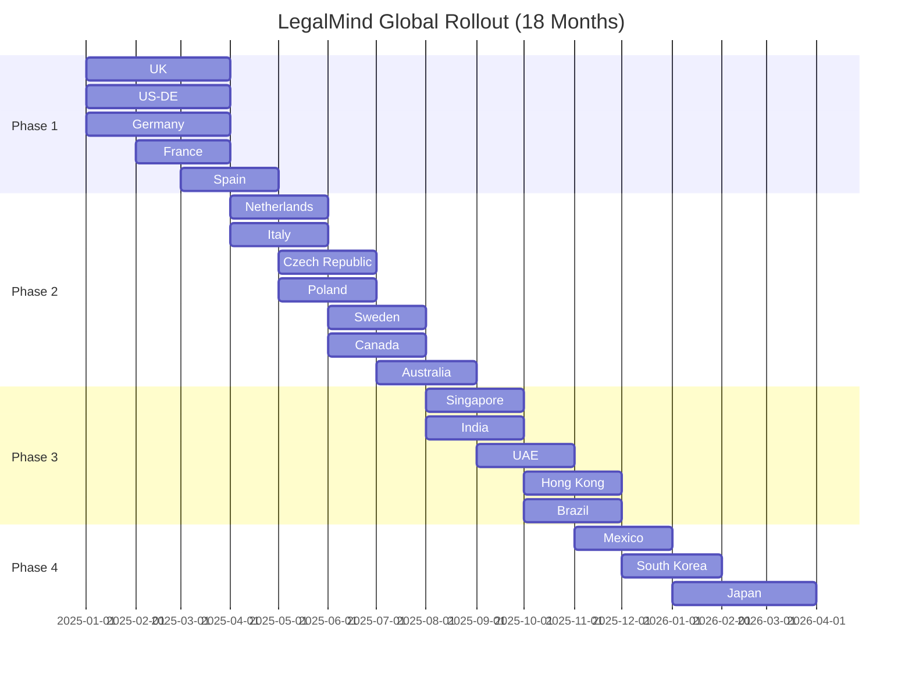
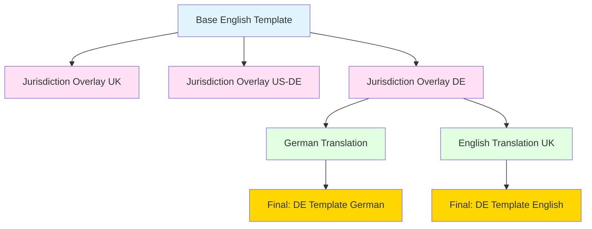
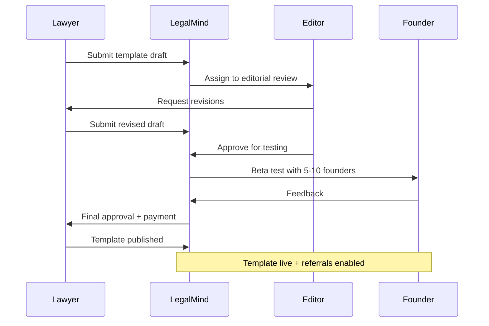
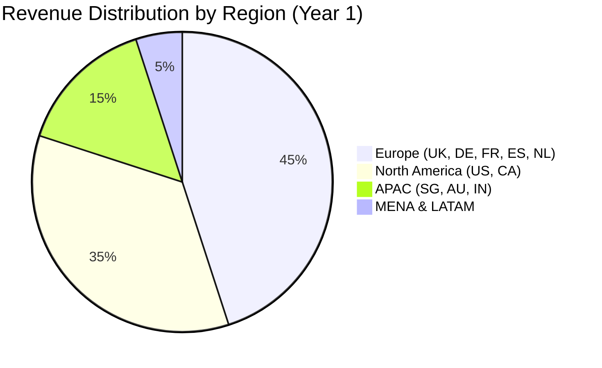

# LegalMind — Global Expansion Roadmap
## Jurisdiction Scaling Strategy (18 Months)

**Version:** 2.0
**Last Updated:** 2025-10-14
**Scope:** 20+ jurisdictions, 10 languages, 50 templates

---

## 1. Expansion Strategy Overview

### 1.1 Guiding Principles
1. **Start Small, Validate Fast:** Launch in 3-5 core jurisdictions, prove PMF before scaling
2. **Legal Quality First:** Never compromise on legal accuracy for speed
3. **Founder-Led Expansion:** Let founder demand dictate jurisdiction priority
4. **Partner-Powered:** Local lawyer partners validate and contribute templates
5. **Revenue-Driven:** Prioritize jurisdictions with high startup density and willingness to pay

### 1.2 Success Metrics
| Metric | Month 3 | Month 6 | Month 12 | Month 18 |
|--------|---------|---------|----------|----------|
| **Jurisdictions Live** | 5 | 10 | 15 | 20 |
| **Templates per Jurisdiction** | 15 | 25 | 35 | 45 |
| **Languages** | 3 | 5 | 8 | 10 |
| **Verified Lawyers** | 20 | 75 | 200 | 400 |
| **Documents Generated** | 1K | 10K | 75K | 200K |
| **Founder Users** | 500 | 3K | 15K | 40K |

---

## 2. Jurisdiction Coverage Map

### 2.1 Phase Breakdown



---

## 3. Phase-by-Phase Rollout

### 📍 Phase 1: Core Anchors (Months 1-3)
**Goal:** Establish baseline in key startup ecosystems with English + 2 languages

| Jurisdiction | Region | Legal System | Startup Density | Launch Month | Priority Templates |
|--------------|--------|--------------|-----------------|--------------|-------------------|
| **🇬🇧 UK** | Europe | Common Law | High (London) | Month 1 | 20 (Founders, Employment, SAFE, NDA, DPA) |
| **🇺🇸 US-DE** | North America | Common Law | Very High (SF, NY) | Month 1 | 20 (Delaware focus, SAFE, Convertible Note) |
| **🇩🇪 Germany** | Europe | Civil Law | High (Berlin) | Month 1 | 18 (GmbH formation, Employment, DPA) |
| **🇫🇷 France** | Europe | Civil Law | Medium (Paris) | Month 2 | 15 (SAS formation, French labor law) |
| **🇪🇸 Spain** | Europe | Civil Law | Medium (Barcelona, Madrid) | Month 3 | 15 (SL formation, Employment) |

**Languages:** English (UK/US), German, French, Spanish
**Lawyer Partners:** 4-5 per jurisdiction = **20-25 lawyers**
**Revenue Potential:** €500K ARR by Month 6

**Key Deliverables:**
- ✅ Core 15-20 templates per jurisdiction (localized)
- ✅ Lawyer verification process operational
- ✅ Stripe payment integration (EUR, USD, GBP)
- ✅ Multi-language UI (EN, DE, FR, ES)
- ✅ Referral tracking system live

---

### 📍 Phase 2: European Expansion + Commonwealth (Months 4-7)
**Goal:** Dominate European startup ecosystems + expand to Commonwealth markets

| Jurisdiction | Region | Legal System | Startup Density | Launch Month | Priority Templates |
|--------------|--------|--------------|-----------------|--------------|-------------------|
| **🇳🇱 Netherlands** | Europe | Civil Law | High (Amsterdam) | Month 4 | 18 (BV formation, Employment, DPA) |
| **🇮🇹 Italy** | Europe | Civil Law | Medium (Milan) | Month 4 | 15 (SRL formation, Employment) |
| **🇨🇿 Czech Republic** | Europe | Civil Law | Medium (Prague) | Month 5 | 15 (SRO formation, Employment) |
| **🇵🇱 Poland** | Europe | Civil Law | Growing (Warsaw) | Month 5 | 15 (Sp. z o.o. formation) |
| **🇸🇪 Sweden** | Europe | Civil Law | High (Stockholm) | Month 6 | 18 (AB formation, Nordic style) |
| **🇨🇦 Canada** | North America | Common Law | High (Toronto, Vancouver) | Month 6 | 18 (Federal + Provincial, Employment) |
| **🇦🇺 Australia** | APAC | Common Law | High (Sydney, Melbourne) | Month 7 | 18 (Pty Ltd, Fair Work Act) |

**Languages Added:** Dutch, Italian, Czech, Polish, Swedish
**Lawyer Partners:** 3-4 per jurisdiction = **25 new lawyers** (50 total)
**Revenue Potential:** €1.5M ARR by Month 9

**Key Deliverables:**
- ✅ Template library expanded to 25-30 per jurisdiction
- ✅ Lawyer marketplace with ratings and reviews
- ✅ Automated translation workflow (EN → target language → lawyer review)
- ✅ Multi-currency pricing (EUR, USD, GBP, CAD, AUD)
- ✅ Referral revenue sharing operational (lawyer payouts)

---

### 📍 Phase 3: APAC + MENA + LATAM (Months 8-11)
**Goal:** Expand to high-growth emerging markets with strong startup ecosystems

| Jurisdiction | Region | Legal System | Startup Density | Launch Month | Priority Templates |
|--------------|--------|--------------|-----------------|--------------|-------------------|
| **🇸🇬 Singapore** | APAC | Common Law | Very High | Month 8 | 20 (Pte Ltd, ACRA compliance, Employment) |
| **🇮🇳 India** | APAC | Common Law (hybrid) | Very High | Month 8 | 18 (Pvt Ltd, Companies Act 2013) |
| **🇦🇪 UAE** | MENA | Civil Law (DIFC Common Law) | High (Dubai) | Month 9 | 15 (Mainland + Free Zone entities) |
| **🇭🇰 Hong Kong** | APAC | Common Law | High | Month 10 | 18 (Ltd company, Hong Kong CA) |
| **🇧🇷 Brazil** | LATAM | Civil Law | High (São Paulo) | Month 10 | 15 (Ltda formation, CLT labor law) |

**Languages Added:** Portuguese, Hindi (future)
**Lawyer Partners:** 4-5 per jurisdiction = **25 new lawyers** (75 total)
**Revenue Potential:** €3M ARR by Month 12

**Key Deliverables:**
- ✅ APAC payment methods (Alipay, regional cards)
- ✅ Time zone-aware support (24/5 coverage)
- ✅ Localized marketing (region-specific content)
- ✅ Accelerator partnerships (500 Startups, Techstars APAC)

---

### 📍 Phase 4: Strategic Growth Markets (Months 12-18)
**Goal:** Complete global coverage with emerging ecosystems

| Jurisdiction | Region | Legal System | Startup Density | Launch Month | Priority Templates |
|--------------|--------|--------------|-----------------|--------------|-------------------|
| **🇲🇽 Mexico** | LATAM | Civil Law | Growing (CDMX, Monterrey) | Month 11 | 15 (SA/SRL, Mexican labor law) |
| **🇰🇷 South Korea** | APAC | Civil Law | High (Seoul) | Month 12 | 15 (Chusik Hoesa, K-employment) |
| **🇯🇵 Japan** | APAC | Civil Law | Medium (Tokyo) | Month 13-15 | 18 (KK/GK formation, Japanese labor law) |
| **🇳🇴 Norway** | Europe | Civil Law | Medium (Oslo) | Month 15 | 12 (AS formation) |
| **🇿🇦 South Africa** | Africa | Mixed (Common + Civil) | Growing (Cape Town) | Month 16 | 12 (Pty Ltd, CIPC) |

**Languages Added:** Japanese, Korean
**Lawyer Partners:** 3-4 per jurisdiction = **20 new lawyers** (100 total)
**Revenue Potential:** €5M ARR by Month 18

---

## 4. Localization Architecture

### 4.1 Template Inheritance Model


### 4.2 Localization Components

#### Layer 1: Base Template (English)
- **Content:** Universal legal concepts (confidentiality, IP, termination)
- **Variables:** Generic placeholders
- **Clauses:** Core structure applicable across jurisdictions

#### Layer 2: Jurisdiction Overlay
- **Governing Law:** Jurisdiction-specific law references
- **Company Types:** Ltd (UK), Inc (US), GmbH (DE), SAS (FR)
- **Currency & Dates:** Localized formats
- **Statutory Requirements:** Minimum wage, notice periods, data protection laws
- **Regulatory References:** Companies Act 2006 (UK), GDPR (EU), Delaware GCL (US)

#### Layer 3: Language Translation
- **UI Text:** Form labels, help text, buttons
- **Legal Content:** Template clauses translated by legal translators
- **Definitions:** Legal terms with jurisdiction-specific meanings
- **Glossary:** Bilingual legal term dictionary

### 4.3 Translation Memory (TMX) Structure
```json
{
  "translation_unit": {
    "source_lang": "en-US",
    "target_lang": "de-DE",
    "segment_id": "founders_agreement_clause_01",
    "source_text": "The Founders agree to assign all Intellectual Property created during the term of this Agreement to the Company.",
    "target_text": "Die Gründer verpflichten sich, alle während der Laufzeit dieser Vereinbarung geschaffenen Rechte des geistigen Eigentums an das Unternehmen abzutreten.",
    "context": "founders_agreement",
    "reviewed_by": "legal_translator_id",
    "reviewed_at": "2025-01-15T10:30:00Z"
  }
}
```

---

## 5. Legal Contributor Network

### 5.1 Lawyer Recruitment Strategy

#### Sourcing Channels
1. **Law Firm Outreach:** Target boutique startup law firms (50-200 lawyer firms)
2. **Accelerator Partnerships:** In-house/network lawyers at Y Combinator, Techstars, 500 Startups
3. **Bar Associations:** Young lawyer divisions, startup law committees
4. **LinkedIn/Legal Communities:** AngelList, Startup Legal Stack, ProductHunt
5. **Referrals:** Early lawyer partners refer colleagues in other jurisdictions

#### Selection Criteria
- ✅ 3+ years startup law experience
- ✅ Active bar membership in target jurisdiction
- ✅ English proficiency (for collaboration)
- ✅ 10+ startup clients (current or past)
- ✅ Positive online reviews/reputation

### 5.2 Contributor Compensation Model

| Contribution Type | Compensation | Payment Terms |
|-------------------|--------------|---------------|
| **Template Drafting** | €500-1,500 per template | Upon approval + publication |
| **Template Review** | €200-500 per review | Upon approval |
| **Jurisdiction Overlay** | €300-800 per jurisdiction | Upon approval |
| **Translation Review** | €150-400 per template | Upon approval |
| **Quarterly Updates** | €200 per template update | Quarterly retainer |
| **Referral Revenue** | 15-25% of engagement value | Post-engagement completion |

**Example Lawyer Earnings (Year 1):**
- **Template Contributions:** 5 templates × €800 = €4,000
- **Quarterly Updates:** 5 templates × €200 × 4 = €4,000
- **Referrals:** 10 clients × €3,000 avg × 20% = €6,000
- **Total:** ~€14,000/year (passive + active)

### 5.3 Contributor Workflow


---

## 6. Jurisdiction Risk Assessment

### 6.1 Risk Matrix
| Jurisdiction | Legal Complexity | UPL Risk | Data Residency | Translation Difficulty | Overall Risk |
|--------------|------------------|----------|----------------|----------------------|--------------|
| UK | Medium | Low | Low | Low | **Low** |
| US-DE | Medium | Medium | Low | Low | **Medium** |
| Germany | High | Medium | Medium | Medium | **Medium-High** |
| France | High | Low | Medium | Medium | **Medium-High** |
| Japan | Very High | Medium | High | Very High | **High** |
| UAE | High | Medium | Medium | Medium | **Medium-High** |
| India | Medium | Low | Medium | High | **Medium** |
| Brazil | High | Low | Medium | High | **Medium-High** |

### 6.2 Risk Mitigation Strategies

#### Unauthorized Practice of Law (UPL)
- **Clear Disclaimers:** "This is a document generator, not legal advice" (pre-generation modal)
- **Lawyer Referral Prominent:** Encourage professional review for all documents
- **No Client Relationship:** Terms of Service explicitly state no attorney-client relationship
- **Template-Only:** Never provide individualized legal advice or strategy
- **ABA Model Rule 5.5 Compliance:** (US jurisdictions)

#### Data Residency & GDPR
- **Regional Data Centers:** EU data stays in EU (Frankfurt/Paris)
- **Standard Contractual Clauses (SCC):** For international data transfers
- **User Consent:** Explicit consent for data processing and cross-border transfers
- **Data Minimization:** Collect only essential information for document generation

#### Translation Accuracy
- **Legal Translator Review:** All translations reviewed by legal-trained translators
- **Native Lawyer Verification:** Local lawyers verify translated content
- **Glossary Maintenance:** Jurisdiction-specific legal term databases
- **Continuous Updates:** Quarterly review cycles for all translations

#### Regulatory Changes
- **Law Monitoring Service:** Subscribe to legal update services (LexisNexis, Westlaw)
- **Quarterly Template Audits:** Review all templates for regulatory changes
- **Lawyer Network Alerts:** Contributors notify of major legal changes
- **Version Control:** All templates versioned with effective dates

---

## 7. Regional Revenue Forecast

### 7.1 Revenue by Region (Month 12)


### 7.2 Detailed Revenue Projections
| Region | Jurisdictions | Users (Month 12) | ARPU | MRR | ARR |
|--------|---------------|------------------|------|-----|-----|
| **Europe** | UK, DE, FR, ES, NL, IT, CZ, PL, SE | 9,000 | €42 | €378K | €4.5M |
| **North America** | US-DE, CA | 4,500 | €48 | €216K | €2.6M |
| **APAC** | SG, AU, IN, HK | 2,250 | €40 | €90K | €1.1M |
| **MENA & LATAM** | UAE, BR, MX | 750 | €38 | €28.5K | €342K |
| **Total** | **15 jurisdictions** | **16,500** | **€43** | **€712K** | **€8.5M ARR** |

**Assumptions:**
- **Conversion Rate:** 5% of visitors → paid users
- **Churn:** 3% monthly (annual churn ~30%)
- **Referral Revenue:** 20% of SaaS revenue (€1.7M additional)
- **Total Year 1 Revenue:** ~€10M ARR

---

## 8. Localization Health Dashboard

### 8.1 Tracking Metrics (Per Jurisdiction)
| Metric | Target | Red (<) | Yellow | Green (>) |
|--------|--------|---------|---------|-----------|
| **Template Coverage** | 35 templates | <15 | 15-25 | >25 |
| **Translation Completeness** | 100% | <70% | 70-90% | >90% |
| **Lawyer Coverage** | 10 lawyers | <3 | 3-7 | >7 |
| **Document Generations** | 500/mo | <100 | 100-300 | >300 |
| **Legal Review Freshness** | <6 months | >12mo | 6-12mo | <6mo |

### 8.2 Example: Germany Status (Month 6)
```json
{
  "jurisdiction": "DE",
  "status": "green",
  "metrics": {
    "templates_live": 28,
    "templates_in_progress": 7,
    "translation_completeness": 95,
    "lawyers_verified": 12,
    "documents_generated_monthly": 850,
    "last_legal_review": "2025-04-15",
    "user_satisfaction": 4.6
  },
  "next_actions": [
    "Complete 7 templates in progress by Month 7",
    "Recruit 3 more lawyers for coverage in Munich/Frankfurt",
    "Translate remaining 5% of UI strings"
  ]
}
```

---

## 9. Strategic Partnerships

### 9.1 Accelerator Partnerships
| Partner | Type | Jurisdictions | Benefit to LegalMind |
|---------|------|---------------|----------------------|
| **Y Combinator** | Accelerator | US-DE, UK | Access to 1,000+ startups/year, brand credibility |
| **Techstars** | Accelerator | US, UK, EU, APAC | Multi-market reach, mentor network |
| **500 Startups** | VC + Accelerator | Global | Emerging market access (LATAM, APAC) |
| **Station F** | Startup Campus | France | Direct access to French startup ecosystem |
| **Startupbootcamp** | Accelerator | EU-wide | European startup network |

**Partnership Model:**
- **Exclusive Offer:** 6 months Pro plan free for accelerator cohorts
- **Co-Marketing:** Joint webinars, content, event sponsorship
- **Referral Revenue:** 10-15% revenue share for direct referrals
- **Mentor Network:** Accelerator lawyers as verified partners

### 9.2 Law Firm Partnerships
**Target:** Boutique startup law firms (10-50 lawyers) in each jurisdiction

**Partnership Benefits:**
- **Deal Flow:** LegalMind refers founders needing full legal support
- **Tool Integration:** Law firms can white-label LegalMind for clients
- **Brand Visibility:** Featured lawyer profiles with premium placement
- **Revenue Share:** 20-25% of referral engagement value

**Example Partners:**
- **UK:** Orrick (London), Taylor Wessing
- **US:** Wilson Sonsini, Cooley, Gunderson Dettmer
- **DE:** Bird & Bird (Germany), Taylor Wessing (Berlin)
- **FR:** August Debouzy, CMS Francis Lefebvre

---

## 10. Expansion Playbook (Per Jurisdiction)

### Step-by-Step Checklist

#### Month -2: Research & Planning
- [ ] Market sizing (startup count, funding data)
- [ ] Competitor landscape analysis
- [ ] Legal system research (company law, employment law)
- [ ] Language requirements assessment
- [ ] Data residency and compliance review

#### Month -1: Partner Recruitment
- [ ] Identify 10-15 target lawyers (LinkedIn, bar associations)
- [ ] Outreach and recruitment (video calls, pitch deck)
- [ ] Sign 3-5 contributor agreements
- [ ] Onboard lawyers to CMS platform

#### Month 0: Template Development
- [ ] Draft 15-20 core templates (base English + jurisdiction overlay)
- [ ] Lawyer review and approval (2 rounds)
- [ ] Translation (if non-English jurisdiction)
- [ ] QA testing (variable validation, output testing)
- [ ] Legal disclaimer customization

#### Month 1: Soft Launch
- [ ] Beta program with 20-30 founders (invite-only)
- [ ] Collect feedback and iterate
- [ ] Fix critical bugs and template issues
- [ ] Onboard 2-3 additional lawyers for referrals

#### Month 2: Public Launch
- [ ] Marketing campaign (SEO, content, PR, social)
- [ ] Lawyer marketplace go-live (referrals enabled)
- [ ] Monitor document generation and errors
- [ ] Weekly template updates based on feedback

#### Month 3: Optimization
- [ ] Add 5-10 additional templates (based on demand)
- [ ] Expand lawyer network (target 10+ lawyers)
- [ ] Localize marketing content (blog, guides)
- [ ] Set up local payment methods (if required)

#### Month 6: Scale & Refine
- [ ] Quarterly legal review (template accuracy)
- [ ] Translation completeness (100% goal)
- [ ] Lawyer satisfaction survey
- [ ] Revenue and usage analytics review
- [ ] Plan expansion to next jurisdiction

---

## 11. Key Risks & Contingencies

### 11.1 Expansion Risks
| Risk | Impact | Mitigation |
|------|--------|------------|
| **Lawyer Recruitment Delays** | High | Start recruitment 3 months early, offer higher initial compensation |
| **Translation Quality Issues** | Medium | Use legal translation agencies, not generic translators |
| **Regulatory Barriers (UPL)** | High | Legal opinion from local counsel before launch, robust disclaimers |
| **Low Founder Adoption** | Medium | Free trial period, accelerator partnerships for distribution |
| **Competitor Entry** | Medium | Focus on quality + lawyer network moat |
| **Legal Liability Claims** | Low | Professional liability insurance (€5M coverage), clear ToS |

### 11.2 Contingency Plans
**If Lawyer Recruitment Fails in Jurisdiction X:**
- Delay launch by 2 months, focus on adjacent jurisdiction
- Offer higher contributor fees (€1,000-2,000 per template)
- Partner with law firm (white-label their lawyers)

**If Translation Budget Exceeds Forecast:**
- Prioritize English-only for initial launch
- Use machine translation + lawyer review (cheaper than full translation)
- Launch with 50% translated content, iterate to 100%

**If Regulatory Challenge Arises:**
- Obtain legal opinion (€5K-10K per jurisdiction)
- Pivot to "legal information" positioning (vs. document generation)
- Require lawyer review for all documents (eliminate DIY option if needed)

---

## 12. Localization Ops Team Structure

### 12.1 Team Roles (by Month 12)
| Role | Headcount | Responsibilities |
|------|-----------|------------------|
| **Head of Legal Ops** | 1 | Overall localization strategy, lawyer relations |
| **Legal Editors** | 3 | Template review, quality assurance, contributor management |
| **Localization Managers** | 2 | Translation workflow, TMX maintenance, glossary |
| **Lawyer Success Managers** | 2 | Lawyer onboarding, referral tracking, payout |
| **Content Translators** (Freelance) | 10-15 | Legal translation (per language) |
| **QA Testers** | 2 | Output testing, bug tracking, user feedback |
| **Total** | **10 FTE + 15 contractors** | |

---

## 13. Success Stories & Case Studies (Planned)

### Month 6: UK Founder Success Story
**"How LegalMind Saved Us £15K in Legal Fees"**
- Founder: Sarah T., FinTech Startup, London
- Documents Generated: Founders' Agreement, Employment Contracts (3), SAFE
- Lawyer Referral: Connected to Bird & Bird for seed round
- Result: Closed £500K seed round, lawyer reviewed for £2K vs. £15K full service

### Month 9: German Startup Case Study
**"From Idea to GmbH in 2 Weeks with LegalMind"**
- Founder: Klaus M., SaaS Startup, Berlin
- Documents: GmbH formation checklist, Founders' Agreement, Employment Contract
- Lawyer Referral: Local Notar for incorporation filing
- Result: Incorporated GmbH, hired first employee, ready for business

### Month 12: APAC Multi-Jurisdiction Expansion
**"Expanding Across APAC with Consistent Legal Templates"**
- Founder: Priya S., E-commerce Platform, Singapore
- Documents: SG Pte Ltd formation, AU Pty Ltd formation, Employment Contracts (SG, AU, IN)
- Lawyer Referral: Lawyers in all 3 jurisdictions for local compliance
- Result: Multi-market launch in 3 months vs. 9 months traditional

---

## 14. Next Steps (Immediate Actions)

### Week 1-2: Foundation
- [ ] **Hire Head of Legal Ops** (experienced legaltech operator)
- [ ] **Design lawyer contributor portal** (CMS for template submission)
- [ ] **Set up translation memory system** (TMX database + workflow)
- [ ] **Legal opinion on UPL risk** (US, UK, DE jurisdictions)

### Week 3-4: Partner Recruitment
- [ ] **Create lawyer recruitment deck** (value prop, compensation, examples)
- [ ] **Outreach to 50 lawyers** (10 per Phase 1 jurisdiction)
- [ ] **Sign first 10 contributor agreements**
- [ ] **Onboard to CMS platform** (training, template drafting begins)

### Month 2-3: Template Development Sprint
- [ ] **Complete 15 core templates** (UK, US-DE, DE)
- [ ] **Lawyer review rounds** (2 rounds per template)
- [ ] **Translation to German** (first non-English jurisdiction)
- [ ] **QA testing and bug fixes**

### Month 3: Beta Launch
- [ ] **Recruit 50 beta founders** (via accelerators, LinkedIn, ProductHunt)
- [ ] **Beta program onboarding** (cohort 1: UK/US founders)
- [ ] **Collect feedback** (surveys, interviews, usage analytics)
- [ ] **Iterate based on feedback** (template improvements, UX fixes)

---

## 15. Conclusion

The global expansion roadmap positions LegalMind to become the **global standard for startup legal infrastructure** within 18 months. By methodically expanding jurisdiction-by-jurisdiction with local lawyer partners, we ensure legal quality while achieving rapid scale.

**Key Success Factors:**
1. **Quality Over Speed:** Never compromise legal accuracy for growth
2. **Lawyer Network Moat:** 100+ verified lawyers by Month 12 creates defensibility
3. **Founder-First:** Listen to founder needs, let demand drive jurisdiction priority
4. **Data-Driven:** Track localization health metrics, iterate aggressively
5. **Partnership-Powered:** Accelerators and law firms accelerate distribution

**Target by Month 18:**
- ✅ 20 jurisdictions live
- ✅ 50 startup templates (avg 35 per jurisdiction)
- ✅ 10 languages supported
- ✅ 100+ verified lawyers
- ✅ 40K founder users
- ✅ €10M ARR (SaaS + referrals)

---

**Document Owner:** Head of Legal Ops + Product
**Review Cycle:** Monthly (adjust based on expansion pace)
**Version Control:** Git-tracked + quarterly board review
