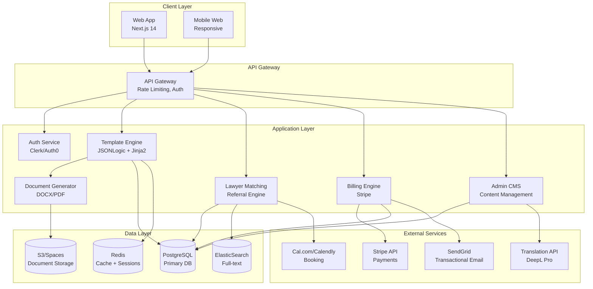
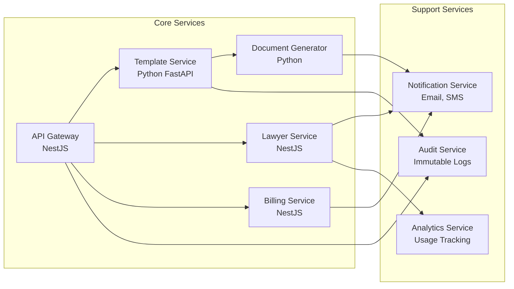
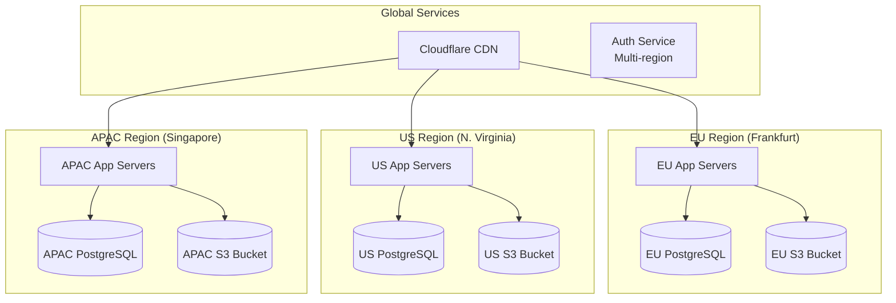
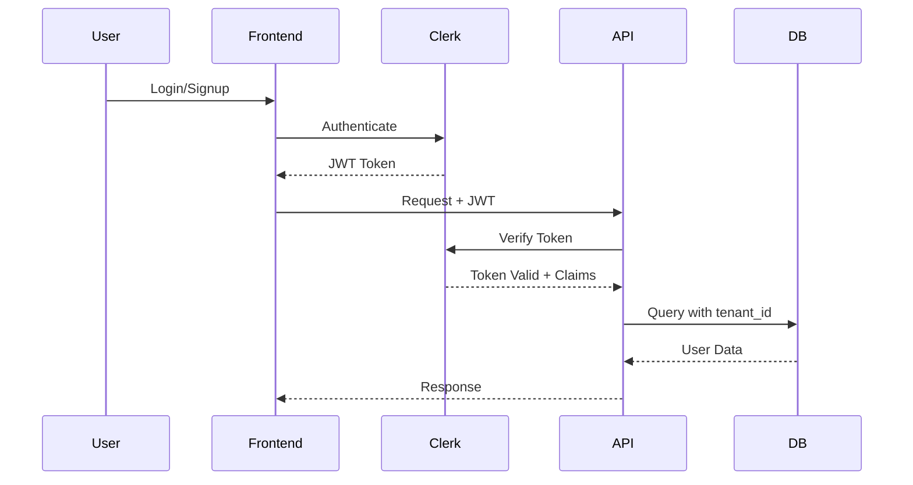

# LegalMind — Startup Legal Stack MVP
## System Architecture & Technical Design

**Version:** 2.0 (Startup Focus)
**Last Updated:** 2025-10-14
**Status:** Architecture Blueprint

---

## 1. Executive Summary

LegalMind is a global startup legal automation platform combining:
- **50+ localized startup templates** across 6 categories
- **20+ jurisdictions** with multi-language support
- **Verified lawyer referral network** for expert validation
- **SaaS + marketplace monetization** model

**Target:** Pre-seed to Series A startups, accelerators, VCs, and incubators worldwide.

---

## 2. System Architecture Overview

---

## 3. Core Architecture Principles

### 3.1 Multi-Tenancy Model
- **B2C:** Individual founders (primary)
- **B2B:** Accelerators, VCs, law firms (white-label ready)
- **Isolation:** Tenant-specific data segregation via `tenant_id`

### 3.2 Jurisdiction-First Design
- Every entity tagged with `jurisdiction_code` and `language_code`
- Template inheritance: base → jurisdiction overlay → language translation
- Clause-level jurisdiction rules via JSONLogic

### 3.3 Scalability Targets
- **Year 1:** 10K users, 50K documents
- **Year 3:** 100K users, 1M documents, 20 jurisdictions
- **Architecture:** Horizontal scaling via containerization (Docker/K8s)

### 3.4 Security & Compliance
- **Data residency:** EU data in EU region (GDPR Article 44)
- **Encryption:** AES-256 at rest, TLS 1.3 in transit
- **Audit:** Immutable audit log for all document generations
- **PII handling:** GDPR Article 6(1)(b) + user consent

---

## 4. Technology Stack (Updated)

### 4.1 Frontend
| Component | Technology | Rationale |
|-----------|-----------|-----------|
| Framework | **Next.js 14** (App Router) | SSR, i18n, SEO-optimized |
| UI Library | **Tailwind CSS** + **Headless UI** | Rapid development, accessible |
| State | **Zustand** + **React Query** | Lightweight, server-state sync |
| i18n | **next-intl** | Jurisdiction-aware localization |
| Forms | **React Hook Form** + **Zod** | Type-safe validation |

### 4.2 Backend
| Component | Technology | Rationale |
|-----------|-----------|-----------|
| Framework | **NestJS** (Node.js) | Enterprise-grade, TypeScript-native |
| API | **REST** + **GraphQL** (future) | REST for MVP, GraphQL for complex queries |
| Auth | **Clerk** | Startup-friendly, multi-tenant ready |
| Queue | **BullMQ** (Redis) | Document generation jobs |
| Caching | **Redis** | Session, rate-limiting, hot templates |

### 4.3 Data & Storage
| Component | Technology | Rationale |
|-----------|-----------|-----------|
| Primary DB | **PostgreSQL 15** | JSONB support, multi-tenant ready |
| Search | **ElasticSearch** | Lawyer profiles, template search |
| Object Storage | **AWS S3** / **DigitalOcean Spaces** | Generated documents (WORM) |
| Vector DB | **Pinecone** (future) | AI-powered clause recommendations |

### 4.4 Document Generation
| Component | Technology | Rationale |
|-----------|-----------|-----------|
| Templating | **Jinja2** (Python microservice) | Legal-grade templating |
| Logic Engine | **JSONLogic** | Declarative conditional clauses |
| DOCX | **docxtemplater** | Complex formatting |
| PDF | **Puppeteer** | High-fidelity rendering |

### 4.5 Payments & Compliance
| Component | Technology | Rationale |
|-----------|-----------|-----------|
| Payments | **Stripe** (EU VAT, subscriptions) | Global coverage, compliance-ready |
| Invoicing | **Stripe Billing** | Automated invoicing |
| KYC | **Stripe Identity** (optional) | Lawyer onboarding |
| GDPR | **Custom audit system** | Right to erasure, portability |

### 4.6 Infrastructure
| Component | Technology | Rationale |
|-----------|-----------|-----------|
| Hosting | **Vercel** (frontend) + **AWS ECS** (backend) | Edge optimization, autoscaling |
| CI/CD | **GitHub Actions** | Automated testing, deployment |
| Monitoring | **DataDog** / **Sentry** | APM, error tracking |
| CDN | **Cloudflare** | DDoS protection, global latency |

---

## 5. Service Architecture (Microservices-Ready)

### 5.1 Service Responsibilities

#### API Gateway (NestJS)
- Authentication & authorization
- Rate limiting & throttling
- Request routing & load balancing
- API versioning (`/v1/`, `/v2/`)

#### Template Service (Python FastAPI)
- Template CRUD operations
- Jurisdiction overlay resolution
- Variable schema validation
- Clause library management

#### Document Generator (Python)
- Async document generation (BullMQ jobs)
- Variable interpolation
- Conditional clause rendering
- DOCX/PDF export pipeline

#### Lawyer Service (NestJS)
- Lawyer profile management
- Verification workflow (3-step)
- Referral matching algorithm
- Revenue tracking & payouts

#### Billing Service (NestJS)
- Stripe webhook handling
- Subscription lifecycle management
- Usage-based billing (future)
- Invoice generation

---

## 6. Data Residency & Compliance Architecture

### 6.1 Data Localization Rules
| User Jurisdiction | Data Region | Backup Region | Notes |
|-------------------|-------------|---------------|-------|
| EU (GDPR) | Frankfurt | Paris | Article 44 compliance |
| UK | London | Frankfurt | UK GDPR alignment |
| US/CA | N. Virginia | Ohio | CCPA/PIPEDA ready |
| APAC | Singapore | Sydney | PDPA compliance |
| LATAM | São Paulo | N. Virginia | LGPD compliance |
| MENA | Dubai (future) | Frankfurt | DIFC DP Law |

---

## 7. Security Architecture

### 7.1 Authentication Flow

### 7.2 Authorization Model (RBAC)
| Role | Permissions |
|------|-------------|
| **Founder (Free)** | Generate 3 docs/mo, view templates |
| **Founder (Starter)** | Generate 5 docs/mo, save drafts |
| **Founder (Pro)** | Unlimited docs, all jurisdictions, lawyer referrals |
| **Lawyer (Verified)** | Profile management, accept referrals, revenue dashboard |
| **Admin (Internal)** | Template CMS, user management, analytics |
| **Super Admin** | Full system access, billing overrides |

### 7.3 Document Security
- **Access Control:** Owner-only access (UUID-based URLs)
- **Expiry:** Download links expire after 7 days
- **Watermarking:** Optional "DRAFT — NOT FOR EXECUTION" watermark
- **Encryption:** S3 server-side encryption (SSE-KMS)
- **Audit:** All document access logged with IP + timestamp

---

## 8. Scalability & Performance Targets

### 8.1 Performance Benchmarks
| Metric | Target | Measurement |
|--------|--------|-------------|
| API Response Time | <200ms (p95) | GraphQL queries |
| Document Generation | <5s (simple), <15s (complex) | DOCX/PDF export |
| Page Load (FCP) | <1.5s | Lighthouse score |
| Search Latency | <100ms | ElasticSearch queries |
| Concurrent Users | 10K (Year 1), 100K (Year 3) | Load testing |

### 8.2 Scaling Strategy
**Horizontal Scaling:**
- API Gateway: 3+ replicas (auto-scale)
- Template Service: 2+ replicas
- Document Generator: 5+ workers (async queue)

**Vertical Scaling:**
- PostgreSQL: Read replicas for analytics
- Redis: Cluster mode for high availability

**CDN Optimization:**
- Static assets cached at edge (Cloudflare)
- API responses cached (5min TTL for templates)

---

## 9. Disaster Recovery & Business Continuity

### 9.1 Backup Strategy
- **Database:** Daily automated backups (30-day retention)
- **Documents:** S3 versioning enabled (90-day retention)
- **Code:** GitHub (primary), GitLab (mirror)

### 9.2 RTO/RPO Targets
| Component | RTO (Recovery Time) | RPO (Data Loss) |
|-----------|---------------------|-----------------|
| API Gateway | <5 minutes | <1 minute |
| Database | <15 minutes | <5 minutes |
| Document Storage | <30 minutes | 0 (versioned) |
| Full System | <1 hour | <15 minutes |

---

## 10. Cost Architecture (Year 1 Projection)

### 10.1 Infrastructure Costs (Monthly)
| Service | Usage | Cost |
|---------|-------|------|
| Vercel Pro | Frontend hosting | $20 |
| AWS ECS (2 instances) | Backend API | $150 |
| PostgreSQL RDS | db.t3.medium | $120 |
| Redis ElastiCache | cache.t3.micro | $30 |
| S3 Storage | 500GB documents | $12 |
| Cloudflare Pro | CDN + DDoS | $20 |
| Clerk (Pro) | 5K MAU | $99 |
| Stripe | 2% transaction fee | Variable |
| DataDog | Monitoring | $150 |
| **Total** | | **~$600/mo** |

### 10.2 Unit Economics
**Assumption:** 1,000 users in Year 1
- **ARPU:** $35/mo (avg across plans)
- **MRR:** $35K
- **Infrastructure:** $600/mo
- **Gross Margin:** 98%

---

## 11. Implementation Roadmap (90 Days)

### Week 1-2: Foundation
- [ ] Set up monorepo (Nx/Turborepo)
- [ ] Configure multi-region infrastructure
- [ ] Implement base auth system (Clerk)
- [ ] Design database schema (see DATABASE_SCHEMA_V2.md)

### Week 3-4: Template Engine
- [ ] Build template CRUD API
- [ ] Implement JSONLogic rule engine
- [ ] Create jurisdiction overlay system
- [ ] Develop variable interpolation logic

### Week 5-6: Document Generation
- [ ] Build async queue (BullMQ)
- [ ] Implement DOCX templating
- [ ] Add PDF conversion pipeline
- [ ] Set up S3 document storage

### Week 7-8: Lawyer Referral
- [ ] Design lawyer profile schema
- [ ] Build verification workflow
- [ ] Implement referral tracking
- [ ] Create revenue attribution system

### Week 9-10: Billing & UX
- [ ] Integrate Stripe subscriptions
- [ ] Build founder dashboard
- [ ] Create template library UI
- [ ] Implement guided Q&A flow

### Week 11-12: Launch Prep
- [ ] Load testing & optimization
- [ ] Legal disclaimer review
- [ ] Content population (20 templates)
- [ ] Beta user onboarding (50 founders)

---

## 12. Key Architectural Decisions (ADRs)

### ADR-001: Multi-Region vs. Single Region
**Decision:** Start with single region (EU), add US/APAC in Phase 2
**Rationale:** Reduces complexity, 70% of early users in EU

### ADR-002: Monolith vs. Microservices
**Decision:** Modular monolith (NestJS) with Python microservice for document generation
**Rationale:** Faster MVP, easy to extract services later

### ADR-003: SQL vs. NoSQL
**Decision:** PostgreSQL with JSONB for flexible schemas
**Rationale:** ACID compliance for billing, JSONB for template metadata

### ADR-004: Real-time vs. Async Document Generation
**Decision:** Async (BullMQ queue)
**Rationale:** Complex documents take 10-15s, better UX with progress tracking

### ADR-005: Embedded vs. External Lawyer Booking
**Decision:** External (Cal.com/Calendly integration)
**Rationale:** Faster MVP, leverage existing scheduling tools

---

## 13. Risk Register

| Risk | Impact | Probability | Mitigation |
|------|--------|-------------|------------|
| **Regulatory compliance (UPL)** | High | Medium | Clear disclaimers, lawyer review, ABA Model Rules compliance |
| **Template legal accuracy** | High | Medium | Verified lawyer contributors, quarterly audits |
| **Multi-jurisdiction complexity** | Medium | High | Phased rollout, jurisdiction inheritance model |
| **Scalability bottlenecks** | Medium | Low | Horizontal scaling, async processing |
| **Lawyer adoption** | Medium | Medium | Referral revenue share (20-25%), success stories |
| **Payment fraud** | Low | Low | Stripe Radar, KYC for lawyers |

---

## 14. Next Steps

1. **Review & Approve** this architecture document
2. **Proceed to** `DATABASE_SCHEMA_V2.md` for detailed ERD
3. **Design** API specification in `OPENAPI_SPEC_V2.yaml`
4. **Build** 50-template library in `STARTUP_TEMPLATE_LIBRARY.md`
5. **Create** UX flows in `UX_WIREFLOWS_V2.md`

---

**Document Owner:** Product & Engineering
**Review Cycle:** Monthly
**Version Control:** Git-tracked
