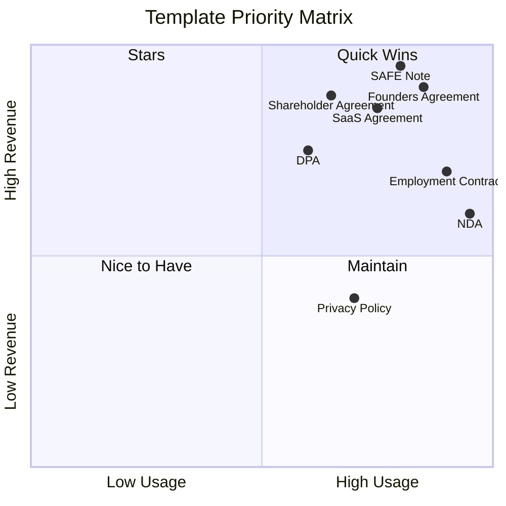
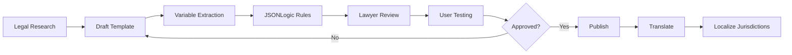

# LegalMind — Startup Template Library
## 50 Essential Legal Documents for Startups

**Version:** 2.0 (Startup Focus)
**Last Updated:** 2025-10-14
**Coverage:** 6 categories, 20 jurisdictions, 10 languages

---

## 1. Template Library Overview

### 1.1 Coverage Summary
| Category | Count | Avg Complexity | Avg Time |
|----------|-------|----------------|----------|
| **A. Founding & Structure** | 12 | 6/10 | 25 min |
| **B. IP & Confidentiality** | 8 | 4/10 | 15 min |
| **C. Employment & HR** | 12 | 5/10 | 20 min |
| **D. Commercial & SaaS** | 8 | 7/10 | 30 min |
| **E. Fundraising & Investment** | 6 | 8/10 | 35 min |
| **F. Compliance & Policies** | 4 | 3/10 | 12 min |
| **Total** | **50** | **5.5/10** | **22 min** |

### 1.2 Priority Matrix

---

## 2. Category A: Founding & Structure (12 Templates)

### A01 — Founders' Agreement
**Code:** `founders-agreement-v1`
**Jurisdictions:** UK, US-DE, DE, FR, ES, NL, CZ
**Complexity:** 7/10 | **Time:** 30 min | **Premium:** Yes

**Description:**
Comprehensive agreement defining founder relationships, equity split, vesting, roles, IP assignment, and exit scenarios.

**Key Variables:**
- Founder names, roles, equity percentages
- Vesting schedule (4-year, 1-year cliff standard)
- IP assignment provisions
- Decision-making thresholds
- Founder termination clauses

**Conditional Logic:**
- If `founder_count > 2` → Include deadlock resolution
- If `vesting_acceleration = true` → Add accelerated vesting clauses
- If `founder_location != same_country` → Add jurisdiction choice

**Use Cases:**
- Pre-incorporation founder alignment
- Equity split documentation
- Vesting agreement formalization
- Co-founder onboarding

**Related Documents:** A02, A03, B01

---

### A02 — Shareholders' Agreement
**Code:** `shareholders-agreement-v1`
**Jurisdictions:** UK, US-DE, DE, FR, ES, NL, IT
**Complexity:** 8/10 | **Time:** 35 min | **Premium:** Yes

**Description:**
Post-incorporation agreement governing shareholder rights, transfer restrictions, drag-along/tag-along, anti-dilution, and board composition.

**Key Variables:**
- Shareholder details and share classes
- Transfer restrictions (ROFR, ROFO)
- Drag-along threshold (typically 75%)
- Tag-along rights
- Board composition rules
- Reserved matters list

**Conditional Logic:**
- If `preferred_shares = true` → Add liquidation preferences
- If `anti_dilution = true` → Include anti-dilution clauses
- If `investor_rights = true` → Add information rights

**Use Cases:**
- Post-seed funding alignment
- Investor rights documentation
- Founder protection mechanisms
- Exit planning (M&A scenarios)

**Related Documents:** A01, E03, E04

---

### A03 — Articles of Association / Certificate of Incorporation
**Code:** `articles-of-association-v1`
**Jurisdictions:** UK, US-DE, DE, FR, NL (jurisdiction-specific)
**Complexity:** 6/10 | **Time:** 25 min | **Premium:** No

**Description:**
Company constitution defining share capital, director powers, shareholder meetings, and amendment procedures. (Multi-jurisdiction overlays)

**Key Variables:**
- Company name and registered office
- Authorized share capital
- Share class definitions
- Director appointment/removal rules
- Quorum requirements

**Jurisdiction Overlays:**
- **UK:** Companies Act 2006 compliant
- **US-DE:** Delaware General Corporation Law
- **DE:** GmbH-Gesetz format
- **FR:** SAS statuts template

**Related Documents:** A01, A02

---

### A04 — Incorporation Checklist
**Code:** `incorporation-checklist-v1`
**Jurisdictions:** All supported (20 jurisdictions)
**Complexity:** 2/10 | **Time:** 10 min | **Premium:** No

**Description:**
Jurisdiction-specific incorporation checklist with timeline, required documents, and filing procedures.

**Key Variables:**
- Jurisdiction selection
- Company type (Ltd, GmbH, SAS, Inc, etc.)
- Formation timeline
- Required documents list

**Conditional Logic:**
- Dynamic checklist based on jurisdiction
- Add VAT registration if EU
- Add EIN if US
- Add data protection registration if UK/EU

**Use Cases:**
- Pre-incorporation planning
- Incorporation service provider briefing
- Compliance verification

---

### A05 — Board Resolution Template
**Code:** `board-resolution-v1`
**Jurisdictions:** All supported
**Complexity:** 3/10 | **Time:** 8 min | **Premium:** No

**Description:**
Standard board resolution template for common corporate actions (share issuance, appointments, contracts approval).

**Resolution Types:**
1. Share issuance
2. Director appointment/removal
3. Registered office change
4. Bank account opening
5. Contract approval (>threshold)
6. Dividend declaration

**Related Documents:** A06, A07

---

### A06 — Share Issuance Form
**Code:** `share-issuance-v1`
**Jurisdictions:** UK, US-DE, DE, FR, ES, NL
**Complexity:** 5/10 | **Time:** 15 min | **Premium:** No

**Description:**
Share issuance documentation including board resolution, allotment notice, and share certificate.

**Key Variables:**
- Allottee details
- Number of shares, share class
- Issue price and consideration
- Payment terms
- Vesting schedule (if applicable)

**Related Documents:** A05, A07

---

### A07 — Share Transfer Form
**Code:** `share-transfer-v1`
**Jurisdictions:** UK, US-DE, DE, FR, ES, NL
**Complexity:** 4/10 | **Time:** 12 min | **Premium:** No

**Description:**
Share transfer agreement with ROFR waiver, board approval, and transfer documentation.

**Key Variables:**
- Transferor/transferee details
- Shares being transferred
- Transfer price
- ROFR waiver confirmation
- Tax implications notice

---

### A08 — Nominee Shareholder Agreement
**Code:** `nominee-agreement-v1`
**Jurisdictions:** UK, US-DE, SG, HK
**Complexity:** 6/10 | **Time:** 20 min | **Premium:** Yes

**Description:**
Agreement where nominee holds shares on behalf of beneficial owner (common in international structures).

---

### A09 — Company Secretary Appointment
**Code:** `company-secretary-v1`
**Jurisdictions:** UK, HK, SG, AU
**Complexity:** 3/10 | **Time:** 10 min | **Premium:** No

---

### A10 — Registered Office Agreement
**Code:** `registered-office-v1`
**Jurisdictions:** UK, DE, FR, ES, NL
**Complexity:** 2/10 | **Time:** 8 min | **Premium:** No

---

### A11 — Shareholder Loan Agreement
**Code:** `shareholder-loan-v1`
**Jurisdictions:** All supported
**Complexity:** 5/10 | **Time:** 18 min | **Premium:** No

**Description:**
Loan from shareholder to company with repayment terms, interest, and subordination clauses.

---

### A12 — Unanimous Consent Resolution
**Code:** `unanimous-consent-v1`
**Jurisdictions:** US-DE, US-CA, UK
**Complexity:** 3/10 | **Time:** 10 min | **Premium:** No

---

## 3. Category B: IP & Confidentiality (8 Templates)

### B01 — IP Assignment Agreement (Founder)
**Code:** `ip-assignment-founder-v1`
**Jurisdictions:** UK, US-DE, DE, FR, ES
**Complexity:** 5/10 | **Time:** 15 min | **Premium:** No

**Description:**
Founder IP assignment ensuring all pre-existing and future IP is assigned to the company.

**Key Variables:**
- Founder details
- Assigned IP description
- Excluded IP (if any)
- Moral rights waiver
- Assignment effective date

**Conditional Logic:**
- If `pre_existing_ip = true` → Add IP disclosure schedule
- If `excluded_ip = true` → Add exclusion carve-outs

**Use Cases:**
- Incorporation IP cleanup
- Investor due diligence prep
- Founder onboarding

**Related Documents:** A01, B02, C01

---

### B02 — Employee Invention Assignment
**Code:** `employee-invention-v1`
**Jurisdictions:** UK, US-DE, DE, FR
**Complexity:** 4/10 | **Time:** 12 min | **Premium:** No

**Description:**
Employee IP assignment (embedded in employment contract or standalone).

**Related Documents:** B01, C01

---

### B03 — NDA (Mutual)
**Code:** `nda-mutual-v1`
**Jurisdictions:** All supported (20)
**Complexity:** 3/10 | **Time:** 10 min | **Premium:** No

**Description:**
Bilateral confidentiality agreement for business discussions, due diligence, partnerships.

**Key Variables:**
- Party names and details
- Confidentiality period (standard: 3-5 years)
- Purpose of disclosure
- Information types (technical, financial, commercial)
- Permitted disclosures

**Use Cases:**
- Investor discussions
- Partnership negotiations
- Vendor evaluations
- M&A due diligence

**Related Documents:** B04, E02

---

### B04 — NDA (Unilateral)
**Code:** `nda-unilateral-v1`
**Jurisdictions:** All supported
**Complexity:** 2/10 | **Time:** 8 min | **Premium:** No

**Description:**
One-way NDA where only one party discloses confidential information.

---

### B05 — Trademark Assignment
**Code:** `trademark-assignment-v1`
**Jurisdictions:** UK, US, EU
**Complexity:** 5/10 | **Time:** 15 min | **Premium:** Yes

**Description:**
Transfer of trademark rights from individual/entity to company.

---

### B06 — Patent Assignment
**Code:** `patent-assignment-v1`
**Jurisdictions:** UK, US, DE, EU
**Complexity:** 6/10 | **Time:** 18 min | **Premium:** Yes

---

### B07 — Copyright License Agreement
**Code:** `copyright-license-v1`
**Jurisdictions:** All supported
**Complexity:** 4/10 | **Time:** 12 min | **Premium:** No

---

### B08 — IP Clause Library
**Code:** `ip-clauses-library-v1`
**Jurisdictions:** All supported
**Complexity:** N/A | **Premium:** No

**Description:**
Reusable IP clauses for contracts (assignment, license, indemnity, infringement).

---

## 4. Category C: Employment & HR (12 Templates)

### C01 — Employment Contract (Full-time)
**Code:** `employment-fulltime-v1`
**Jurisdictions:** UK, US-DE, DE, FR, ES, NL, CZ, PL
**Complexity:** 6/10 | **Time:** 25 min | **Premium:** No

**Description:**
Comprehensive employment agreement covering role, compensation, benefits, IP assignment, confidentiality, termination.

**Key Variables:**
- Employee details (name, address, start date)
- Job title and description
- Salary and payment frequency
- Bonus/equity provisions
- Working hours and location
- Probation period
- Notice period
- Holiday entitlement
- Confidentiality and IP clauses
- Post-termination restrictions (non-compete)

**Conditional Logic:**
- If `equity_grant = true` → Add equity provisions and vesting
- If `remote_work = true` → Add remote work policy
- If `non_compete = true` → Add non-compete clauses (jurisdiction-dependent)

**Jurisdiction Overlays:**
- **UK:** Employment Rights Act 1996 compliant, statutory sick pay, pension auto-enrollment
- **DE:** Arbeitsrecht compliant, works council provisions, Kündigungsschutz
- **FR:** Code du travail compliant, 35-hour week, collective agreements
- **US:** At-will employment, FLSA exempt/non-exempt

**Use Cases:**
- Hiring first employees
- Formalizing employment relationships
- Investor due diligence prep

**Related Documents:** B02, C02, C03, C06

---

### C02 — Contractor Agreement (Independent)
**Code:** `contractor-independent-v1`
**Jurisdictions:** UK, US-DE, DE, FR, ES, NL
**Complexity:** 5/10 | **Time:** 18 min | **Premium:** No

**Description:**
Independent contractor agreement with SOW, deliverables, IP assignment, IR35/misclassification safeguards.

**Key Variables:**
- Contractor details and company
- Services description
- Fee structure (hourly/project)
- Payment terms
- IP ownership
- Liability and indemnity
- Termination notice

**Conditional Logic:**
- If `uk_jurisdiction = true` → Add IR35 compliance clauses
- If `ongoing_retainer = true` → Add retainer terms
- If `expenses_reimbursable = true` → Add expense policy

**Related Documents:** C03, B02

---

### C03 — Advisor Agreement
**Code:** `advisor-agreement-v1`
**Jurisdictions:** UK, US-DE, DE, FR, ES
**Complexity:** 4/10 | **Time:** 15 min | **Premium:** No

**Description:**
Startup advisor agreement with equity compensation, time commitment, confidentiality, and expectations.

**Key Variables:**
- Advisor name and background
- Advisory services description
- Equity grant (typically 0.1%-1%)
- Vesting schedule (2-year monthly vesting standard)
- Time commitment (hours/month)
- Termination terms

**Use Cases:**
- Onboarding startup advisors
- Formalizing equity-for-advice arrangements
- Board observer roles

**Related Documents:** C01, E01

---

### C04 — Offer Letter
**Code:** `offer-letter-v1`
**Jurisdictions:** All supported
**Complexity:** 2/10 | **Time:** 8 min | **Premium:** No

**Description:**
Job offer letter with role, compensation, start date, and contingencies.

---

### C05 — Promotion Letter
**Code:** `promotion-letter-v1`
**Jurisdictions:** All supported
**Complexity:** 2/10 | **Time:** 8 min | **Premium:** No

---

### C06 — Termination Letter
**Code:** `termination-letter-v1`
**Jurisdictions:** UK, US-DE, DE, FR, ES, NL
**Complexity:** 4/10 | **Time:** 12 min | **Premium:** No

**Description:**
Employment termination letter with effective date, final pay, return of property, and post-termination obligations.

---

### C07 — Resignation Acceptance Letter
**Code:** `resignation-acceptance-v1`
**Jurisdictions:** All supported
**Complexity:** 2/10 | **Time:** 6 min | **Premium:** No

---

### C08 — Probation Review Template
**Code:** `probation-review-v1`
**Jurisdictions:** UK, DE, FR, ES
**Complexity:** 3/10 | **Time:** 10 min | **Premium:** No

---

### C09 — Performance Improvement Plan (PIP)
**Code:** `pip-v1`
**Jurisdictions:** UK, US, DE, FR
**Complexity:** 4/10 | **Time:** 15 min | **Premium:** No

---

### C10 — Remote Work Agreement
**Code:** `remote-work-v1`
**Jurisdictions:** All supported
**Complexity:** 3/10 | **Time:** 10 min | **Premium:** No

---

### C11 — Internship Agreement
**Code:** `internship-v1`
**Jurisdictions:** UK, US-DE, DE, FR, ES
**Complexity:** 4/10 | **Time:** 12 min | **Premium:** No

---

### C12 — Stock Option Grant Letter
**Code:** `stock-option-grant-v1`
**Jurisdictions:** UK (EMI), US (ISO/NSO), DE
**Complexity:** 6/10 | **Time:** 20 min | **Premium:** Yes

**Description:**
Employee stock option grant with vesting, exercise price, and tax implications.

---

## 5. Category D: Commercial & SaaS (8 Templates)

### D01 — Master Service Agreement (MSA)
**Code:** `msa-v1`
**Jurisdictions:** UK, US-DE, DE, FR, ES, NL
**Complexity:** 8/10 | **Time:** 35 min | **Premium:** Yes

**Description:**
Framework agreement for recurring B2B services with liability caps, IP provisions, termination, and SOW structure.

**Key Variables:**
- Client and vendor details
- Services description (high-level)
- Payment terms and invoicing
- Liability cap (e.g., 12 months fees)
- IP ownership
- Confidentiality
- Term and termination
- Dispute resolution

**Conditional Logic:**
- If `data_processing = true` → Include DPA reference (D05)
- If `sla_required = true` → Add SLA appendix
- If `escrow_required = true` → Add source code escrow clause

**Use Cases:**
- B2B SaaS customer contracts
- Agency/consulting ongoing relationships
- Multi-project vendor frameworks

**Related Documents:** D02, D03, D05

---

### D02 — SaaS Subscription Agreement
**Code:** `saas-subscription-v1`
**Jurisdictions:** UK, US-DE, DE, FR, ES, EU-BASE
**Complexity:** 7/10 | **Time:** 30 min | **Premium:** Yes

**Description:**
Software-as-a-Service agreement with subscription terms, usage limits, SLA, data protection, and termination.

**Key Variables:**
- SaaS provider and customer details
- Service description
- Subscription tier and pricing
- User limits and usage metrics
- SLA commitments (uptime %)
- Data processing terms
- Support levels
- Payment terms (monthly/annual)
- Auto-renewal terms

**Conditional Logic:**
- If `eu_customer = true` → GDPR data processing clauses (reference D05)
- If `enterprise_tier = true` → Custom SLA and support
- If `api_access = true` → API terms and rate limits

**Use Cases:**
- SaaS product customer agreements
- Platform subscription terms
- Enterprise software licensing

**Related Documents:** D01, D05, F01

---

### D03 — Statement of Work (SOW)
**Code:** `sow-v1`
**Jurisdictions:** UK, US-DE, DE, FR
**Complexity:** 6/10 | **Time:** 25 min | **Premium:** No

**Description:**
Project-specific SOW with deliverables, timeline, acceptance criteria, and payment milestones (usually under MSA).

**Key Variables:**
- Project name and description
- Deliverables list with descriptions
- Timeline and milestones
- Payment schedule
- Acceptance criteria
- Change request process
- Resource allocation

**Related Documents:** D01, C02

---

### D04 — Pilot/POC Agreement
**Code:** `pilot-poc-v1`
**Jurisdictions:** UK, US-DE, DE, FR, ES
**Complexity:** 5/10 | **Time:** 18 min | **Premium:** No

**Description:**
Proof-of-concept or pilot agreement with limited scope, evaluation criteria, and conversion terms.

---

### D05 — Data Processing Agreement (DPA)
**Code:** `dpa-gdpr-v1`
**Jurisdictions:** EU-BASE, UK, DE, FR, ES, NL
**Complexity:** 7/10 | **Time:** 25 min | **Premium:** Yes

**Description:**
GDPR Article 28 compliant DPA for processor-controller relationships with security measures, sub-processors, and data breach obligations.

**Key Variables:**
- Controller and processor details
- Processing purpose and scope
- Data categories and subject types
- Processing duration
- Security measures (technical and organizational)
- Sub-processor list
- Data subject rights procedures
- Audit rights
- Data breach notification (72 hours)

**Conditional Logic:**
- If `international_transfers = true` → Add SCC (Standard Contractual Clauses)
- If `sub_processors = true` → Add sub-processor approval mechanism

**Use Cases:**
- SaaS vendor data processing terms
- Third-party processor agreements
- Marketing service data handling

**Related Documents:** D01, D02, F02

---

### D06 — Agency Agreement
**Code:** `agency-agreement-v1`
**Jurisdictions:** UK, US-DE, DE, FR, ES
**Complexity:** 6/10 | **Time:** 22 min | **Premium:** No

**Description:**
Sales/distribution agency agreement with commission, territory, and performance terms.

---

### D07 — Reseller Agreement
**Code:** `reseller-agreement-v1`
**Jurisdictions:** UK, US-DE, DE, FR
**Complexity:** 6/10 | **Time:** 22 min | **Premium:** Yes

---

### D08 — Software License Agreement (On-Premise)
**Code:** `software-license-v1`
**Jurisdictions:** UK, US-DE, DE
**Complexity:** 7/10 | **Time:** 28 min | **Premium:** Yes

---

## 6. Category E: Fundraising & Investment (6 Templates)

### E01 — SAFE Agreement (YC Standard)
**Code:** `safe-yc-v1`
**Jurisdictions:** US-DE, UK (adapted), EU-BASE
**Complexity:** 7/10 | **Time:** 25 min | **Premium:** Yes

**Description:**
Y Combinator SAFE (Simple Agreement for Future Equity) with valuation cap, discount, and pro-rata rights.

**Key Variables:**
- Investor name and investment amount
- Valuation cap (e.g., $10M)
- Discount rate (typically 15-20%)
- Pro-rata rights (yes/no)
- Most Favored Nation (MFN) clause
- Company details

**SAFE Variants:**
1. **Valuation Cap, No Discount**
2. **Discount, No Cap**
3. **Cap + Discount** (most common)
4. **MFN** (investor-friendly)

**Conditional Logic:**
- If `pro_rata = true` → Add pro-rata participation rights
- If `mfn = true` → Add MFN clause

**Use Cases:**
- Pre-seed and seed funding
- Angel investor rounds
- Fast fundraising without valuation

**Related Documents:** E02, E03, E04

---

### E02 — Convertible Note
**Code:** `convertible-note-v1`
**Jurisdictions:** US-DE, UK, DE
**Complexity:** 8/10 | **Time:** 30 min | **Premium:** Yes

**Description:**
Debt instrument converting to equity on qualifying financing with interest rate, maturity date, and conversion mechanics.

**Key Variables:**
- Principal amount
- Interest rate (typically 2-8%)
- Maturity date (12-24 months)
- Valuation cap
- Conversion discount
- Qualified financing threshold (e.g., $1M)
- Conversion trigger events

**Related Documents:** E01, E03

---

### E03 — Term Sheet (Seed/Series A)
**Code:** `term-sheet-seed-v1`
**Jurisdictions:** UK, US-DE, DE, FR
**Complexity:** 9/10 | **Time:** 40 min | **Premium:** Yes

**Description:**
Non-binding term sheet outlining key investment terms: valuation, investment amount, liquidation preferences, board composition, voting rights.

**Key Terms:**
- Pre-money valuation
- Investment amount and post-money
- Liquidation preference (1x participating/non-participating)
- Anti-dilution protection (weighted average)
- Board composition (founders/investors/independent)
- Voting rights and protective provisions
- Drag-along and tag-along
- Employee option pool (pre/post-money)
- Information rights
- Exclusivity and no-shop period

**Related Documents:** E04, A02

---

### E04 — Investor Rights Agreement
**Code:** `investor-rights-v1`
**Jurisdictions:** UK, US-DE, DE
**Complexity:** 8/10 | **Time:** 35 min | **Premium:** Yes

**Description:**
Post-investment agreement defining information rights, registration rights, right of first refusal, and co-sale rights.

---

### E05 — Subscription Agreement (Equity)
**Code:** `subscription-agreement-v1`
**Jurisdictions:** UK, US-DE, DE, FR
**Complexity:** 7/10 | **Time:** 28 min | **Premium:** Yes

---

### E06 — Cap Table Template
**Code:** `cap-table-v1`
**Jurisdictions:** All supported
**Complexity:** N/A | **Premium:** No

**Description:**
Excel/Google Sheets cap table template with dilution modeling, option pool, and investor tracking.

---

## 7. Category F: Compliance & Policies (4 Templates)

### F01 — Website Terms of Use
**Code:** `website-terms-v1`
**Jurisdictions:** UK, US, EU-BASE, DE, FR, ES
**Complexity:** 4/10 | **Time:** 15 min | **Premium:** No

**Description:**
Website terms and conditions covering user obligations, IP rights, disclaimers, and limitation of liability.

**Key Variables:**
- Company name and website URL
- User eligibility (age, location)
- Prohibited conduct
- IP ownership
- User-generated content policy
- Disclaimers and warranty exclusions
- Liability limitations
- Governing law and dispute resolution

**Conditional Logic:**
- If `user_accounts = true` → Add account terms
- If `e_commerce = true` → Add purchase terms (reference F04)
- If `eu_users = true` → GDPR compliance clauses

**Related Documents:** F02, F03

---

### F02 — Privacy Policy
**Code:** `privacy-policy-gdpr-v1`
**Jurisdictions:** UK, EU-BASE, DE, FR, ES, US (CCPA-ready)
**Complexity:** 5/10 | **Time:** 20 min | **Premium:** No

**Description:**
GDPR-compliant privacy policy detailing data collection, processing, retention, user rights, and third-party sharing.

**Key Sections:**
1. Data controller details
2. Data collected (categories)
3. Processing purposes and legal bases
4. Data retention periods
5. User rights (access, erasure, portability)
6. Cookie usage
7. Third-party processors/transfers
8. Security measures
9. Contact details (DPO if applicable)

**Conditional Logic:**
- If `cookies = true` → Add cookie section (reference F03)
- If `marketing = true` → Add marketing consent provisions
- If `us_users = true` → Add CCPA disclosures

**Related Documents:** F01, F03, D05

---

### F03 — Cookie Policy
**Code:** `cookie-policy-v1`
**Jurisdictions:** UK, EU-BASE, DE, FR, ES
**Complexity:** 3/10 | **Time:** 10 min | **Premium:** No

**Description:**
Cookie usage disclosure and consent mechanism (ePrivacy Directive compliance).

---

### F04 — Anti-Bribery & Corruption Policy
**Code:** `abc-policy-v1`
**Jurisdictions:** UK (Bribery Act), US (FCPA), EU
**Complexity:** 4/10 | **Time:** 12 min | **Premium:** Yes

**Description:**
Internal policy prohibiting bribery, corruption, and facilitation payments with reporting procedures.

---

## 8. Implementation Roadmap

### Phase 1 (Weeks 1-4): Core 20 Templates
**Priority: Must-have for MVP**

| Template | Category | Jurisdictions | Status |
|----------|----------|---------------|--------|
| A01 - Founders' Agreement | Founding | UK, US-DE, DE | ✅ Specified |
| A02 - Shareholders' Agreement | Founding | UK, US-DE, DE | ✅ Specified |
| B01 - IP Assignment | IP | UK, US-DE, DE, FR | ✅ Specified |
| B03 - NDA (Mutual) | IP | All 20 | ✅ Specified |
| C01 - Employment Contract | HR | UK, US-DE, DE, FR | ✅ Specified |
| C02 - Contractor Agreement | HR | UK, US-DE, DE | ✅ Specified |
| C03 - Advisor Agreement | HR | UK, US-DE, DE | ✅ Specified |
| D01 - MSA | Commercial | UK, US-DE, DE | ✅ Specified |
| D02 - SaaS Agreement | Commercial | UK, US-DE, EU | ✅ Specified |
| D05 - DPA (GDPR) | Commercial | EU, UK | ✅ Specified |
| E01 - SAFE | Fundraising | US-DE, UK | ✅ Specified |
| E02 - Convertible Note | Fundraising | US-DE, UK, DE | ✅ Specified |
| E03 - Term Sheet | Fundraising | UK, US-DE, DE | ✅ Specified |
| F01 - Website Terms | Compliance | UK, US, EU | ✅ Specified |
| F02 - Privacy Policy | Compliance | UK, EU, US | ✅ Specified |

**Target:** 15 templates, 3-5 jurisdictions each → **45 jurisdiction-variants**

### Phase 2 (Weeks 5-8): Expand to 35 Templates
Add:
- Remaining Founding & Structure (A03-A12)
- IP templates (B02, B04, B05)
- HR templates (C04-C08)
- Commercial templates (D03, D04, D06)

### Phase 3 (Weeks 9-12): Complete 50 Templates
Add:
- Advanced fundraising docs (E04-E06)
- Compliance policies (F03-F04)
- Niche templates based on user feedback

---

## 9. Template Development Workflow

### 9.1 Template Creation Process

### 9.2 Quality Checklist
- [ ] Legal accuracy verified by qualified lawyer (jurisdiction-specific)
- [ ] Variables clearly defined with validation rules
- [ ] Conditional logic tested (all paths)
- [ ] Jurisdiction overlays validated
- [ ] Translations reviewed by legal translator
- [ ] Sample output generated and reviewed
- [ ] Disclaimers present and prominent
- [ ] User testing completed (min 5 founders)

---

## 10. Template Pricing Strategy

### 10.1 Tiering Logic
| Tier | Template Type | Examples | Pricing |
|------|---------------|----------|---------|
| **Free** | Essential policies | Website Terms, Cookie Policy | €0 |
| **Standard** | Basic operations | NDA, Employment Contract, Board Resolutions | Included in Starter (€19/mo) |
| **Premium** | High-value | Founders' Agreement, SAFE, DPA, MSA | Pro plan (€49/mo) |
| **Enterprise** | Complex/custom | Custom shareholders' agreement, M&A docs | Scale plan (€99/mo) or custom |

### 10.2 Bundling Strategy
**Bundle: "Pre-Seed Starter Pack"** (€99 one-time)
- Founders' Agreement
- IP Assignment (all founders)
- NDA templates
- Advisor Agreement template
- Employment contract template

**Bundle: "Fundraising Ready"** (€199 one-time)
- SAFE + Convertible Note
- Term Sheet template
- Investor Rights Agreement
- Cap Table template

---

## 11. Next Steps

1. **Legal Contributors:** Recruit 10-15 startup lawyers (1-2 per key jurisdiction)
2. **Template Development:** Begin Phase 1 (20 core templates)
3. **Translation Memory:** Set up TMX and glossary system
4. **User Testing:** Beta program with 50 founders (10 per jurisdiction)
5. **CMS Integration:** Build template authoring system (see ADMIN_CMS.md)

---

**Document Owner:** Legal & Product
**Review Cycle:** Quarterly (legal updates)
**Version Control:** Git-tracked + legal review log
