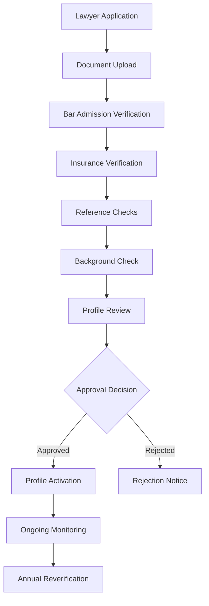
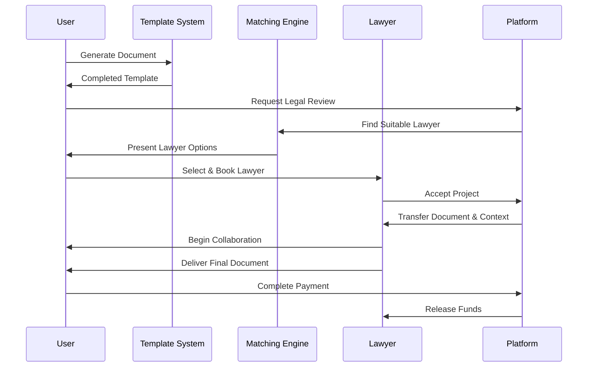

# LegalMind Step 2: Professional Network & Collaboration Platform
## Complete Implementation Framework

### Executive Summary

Building on Step 1's template automation system, Step 2 transforms LegalMind into a comprehensive two-sided marketplace connecting users with qualified legal professionals. This creates a complete legal services ecosystem that maintains template efficiency while providing professional oversight and customization.

---

## Professional Network Architecture

### A. Lawyer Directory & Verification System

#### A.1 Professional Profiles
```json
{
  "lawyer_profile": {
    "basic_info": {
      "first_name": "string",
      "last_name": "string",
      "firm_name": "string",
      "title": "string",
      "profile_photo": "url",
      "bio": "text",
      "languages": ["en-UK", "de-DE"],
      "time_zone": "string"
    },
    "credentials": {
      "bar_admissions": [
        {
          "jurisdiction": "UK-England-Wales",
          "admission_date": "date",
          "bar_number": "string",
          "status": "active|suspended|retired",
          "verified": true
        }
      ],
      "education": [
        {
          "institution": "string",
          "degree": "string",
          "graduation_year": "number",
          "honors": "string"
        }
      ],
      "certifications": ["specialist_certifications"],
      "insurance": {
        "provider": "string",
        "policy_number": "string",
        "coverage_amount": "number",
        "expiry_date": "date",
        "verified": true
      }
    },
    "specializations": {
      "primary_areas": ["corporate", "employment", "ip"],
      "secondary_areas": ["dispute_resolution"],
      "experience_years": 8,
      "notable_cases": ["case_summaries"],
      "client_types": ["startup", "sme", "individual"]
    },
    "jurisdiction_coverage": {
      "licensed_jurisdictions": ["UK", "EU-BASE"],
      "collaboration_jurisdictions": ["US-DE", "CA"],
      "referral_network": ["AU", "SG"]
    },
    "service_offerings": {
      "document_review": {
        "available": true,
        "turnaround_hours": 24,
        "price_range": {
          "min": 150,
          "max": 500,
          "currency": "GBP"
        }
      },
      "custom_modifications": {
        "available": true,
        "complexity_levels": ["simple", "medium", "complex"],
        "pricing_model": "fixed|hourly"
      },
      "consultations": {
        "available": true,
        "duration_options": [30, 60, 90],
        "price_per_hour": 350,
        "video_calls": true,
        "phone_calls": true
      },
      "full_representation": {
        "available": false,
        "practice_areas": [],
        "retainer_required": false
      }
    },
    "availability": {
      "working_hours": {
        "monday": {"start": "09:00", "end": "17:00"},
        "timezone": "Europe/London"
      },
      "response_time": {
        "average_hours": 2.5,
        "guarantee_hours": 6
      },
      "current_capacity": "high|medium|low",
      "vacation_mode": false
    },
    "performance_metrics": {
      "rating": 4.8,
      "review_count": 127,
      "completion_rate": 98.5,
      "repeat_client_rate": 45.2,
      "response_time_avg": 2.1,
      "project_count": 342
    }
  }
}
```

#### A.2 Verification Workflow


**Verification Requirements:**
- Bar admission certificates (all jurisdictions)
- Professional liability insurance (minimum coverage requirements)
- Character references from 3 legal professionals
- Background check clearance
- Continuing education records
- Sample work portfolio

### B. Smart Matching Algorithm

#### B.1 Matching Criteria Matrix
```python
class LawyerMatchingEngine:
    def __init__(self):
        self.scoring_weights = {
            'jurisdiction_match': 0.25,      # Critical for legal validity
            'specialization_match': 0.20,    # Expertise alignment
            'experience_level': 0.15,        # Complexity handling
            'availability': 0.10,            # Timeline requirements
            'pricing_fit': 0.10,            # Budget alignment
            'language_match': 0.08,          # Communication
            'rating_score': 0.07,           # Quality indicator
            'past_performance': 0.05         # Track record
        }

    def calculate_match_score(self, lawyer, request):
        score = 0

        # Jurisdiction compatibility
        if request.jurisdiction in lawyer.licensed_jurisdictions:
            score += self.scoring_weights['jurisdiction_match'] * 1.0
        elif request.jurisdiction in lawyer.collaboration_jurisdictions:
            score += self.scoring_weights['jurisdiction_match'] * 0.7

        # Specialization alignment
        specialization_score = self._calculate_specialization_match(
            lawyer.specializations, request.document_type
        )
        score += self.scoring_weights['specialization_match'] * specialization_score

        # Experience vs complexity
        experience_score = min(
            lawyer.experience_years / request.complexity_requirement, 1.0
        )
        score += self.scoring_weights['experience_level'] * experience_score

        # Additional scoring logic...

        return score
```

#### B.2 Request Processing Flow
1. **User Submits Request**: Document type, jurisdiction, urgency, budget
2. **Initial Filtering**: Remove unavailable/unqualified lawyers
3. **Scoring Algorithm**: Calculate match scores for eligible lawyers
4. **Ranking & Selection**: Present top 5-10 matches with explanations
5. **User Choice**: Client selects preferred lawyer(s)
6. **Automatic Booking**: System handles scheduling and payment

### C. Collaboration Tools & Workflow

#### C.1 Project Management System
```json
{
  "project": {
    "id": "uuid",
    "type": "document_review",
    "status": "in_progress",
    "client_id": "uuid",
    "lawyer_id": "uuid",
    "template_used": "nda-mutual-v1",
    "timeline": {
      "created_at": "datetime",
      "due_date": "datetime",
      "completed_at": null,
      "milestones": [
        {
          "name": "Initial Review",
          "due_date": "datetime",
          "status": "completed",
          "completed_by": "lawyer"
        }
      ]
    },
    "documents": [
      {
        "id": "uuid",
        "name": "NDA_Draft_v1.docx",
        "version": 1,
        "uploaded_by": "client",
        "annotations": 12,
        "status": "under_review"
      }
    ],
    "communication": {
      "messages": [
        {
          "id": "uuid",
          "sender": "lawyer",
          "timestamp": "datetime",
          "content": "I've reviewed the initial draft...",
          "attachments": []
        }
      ],
      "meetings": [
        {
          "id": "uuid",
          "scheduled_for": "datetime",
          "duration_minutes": 30,
          "type": "video_call",
          "status": "completed",
          "recording_url": "secure_url"
        }
      ]
    },
    "billing": {
      "pricing_model": "fixed_fee",
      "agreed_amount": 350,
      "currency": "GBP",
      "payments": [],
      "escrow_status": "funded"
    }
  }
}
```

#### C.2 Document Collaboration Features

**Real-time Editing:**
- Collaborative document editing with lawyer and client
- Version control with change tracking
- Comment threads and suggestion mode
- Legal-specific annotation tools

**Review Workflow:**
- Structured review checklist based on document type
- Risk assessment scoring with explanations
- Jurisdiction-specific compliance checking
- Alternative clause suggestions

**Communication Integration:**
- In-document chat and video calls
- Screen sharing for complex explanations
- Secure file sharing with encryption
- Mobile app for on-the-go access

### D. Quality Assurance & Rating System

#### D.1 Multi-dimensional Rating Framework
```json
{
  "review_criteria": {
    "legal_accuracy": {
      "weight": 0.30,
      "questions": [
        "Were all legal requirements addressed?",
        "Was the advice jurisdiction-appropriate?",
        "Were risks properly identified and explained?"
      ],
      "scoring": "1-5 scale"
    },
    "communication_quality": {
      "weight": 0.25,
      "questions": [
        "Were explanations clear and understandable?",
        "Was the lawyer responsive to questions?",
        "Was communication professional and timely?"
      ]
    },
    "timeliness": {
      "weight": 0.20,
      "questions": [
        "Was the work completed on time?",
        "Were deadlines communicated clearly?",
        "Was the lawyer available when needed?"
      ]
    },
    "value_for_money": {
      "weight": 0.15,
      "questions": [
        "Was the pricing fair for the service provided?",
        "Did the lawyer deliver what was promised?",
        "Would you hire this lawyer again?"
      ]
    },
    "overall_experience": {
      "weight": 0.10,
      "questions": [
        "How was your overall experience?",
        "Would you recommend this lawyer?",
        "Did the lawyer exceed expectations?"
      ]
    }
  }
}
```

#### D.2 Peer Review System
- **Professional Evaluation**: Lawyers review each other's work anonymously
- **Mentorship Program**: Senior lawyers guide junior colleagues
- **Knowledge Sharing**: Best practices and case studies
- **Continuous Education**: Platform-sponsored training and updates

---

## Service Offering Framework

### E. Core Service Tiers

#### E.1 Document Review (Tier 1)
**Service Description**: Professional review of template-generated documents

**Deliverables**:
- Legal accuracy verification
- Jurisdiction-specific compliance check
- Risk assessment with mitigation recommendations
- Comments and suggested improvements
- Final approval or revision recommendations

**Pricing Structure**:
- Simple documents (T&Cs, NDAs): £150-300
- Medium complexity (Service Agreements): £300-500
- Complex documents (Investment Agreements): £500-800

**Turnaround Time**: 6-48 hours depending on complexity

#### E.2 Custom Modifications (Tier 2)
**Service Description**: Professional customization of templates for specific needs

**Deliverables**:
- Customized clauses based on client requirements
- Jurisdiction-specific adaptations
- Industry-specific modifications
- Risk-optimized alternatives
- Complete redrafted sections as needed

**Pricing Structure**:
- Minor modifications (1-3 clauses): £200-400
- Moderate changes (multiple sections): £400-800
- Major customization (substantial rewrite): £800-1500

**Turnaround Time**: 1-5 business days

#### E.3 Full Legal Services (Tier 3)
**Service Description**: Complete legal representation and ongoing support

**Deliverables**:
- End-to-end legal project management
- Negotiation support and strategy
- Ongoing legal counsel and advice
- Dispute resolution and litigation support
- Compliance monitoring and updates

**Pricing Structure**:
- Hourly rates: £200-600/hour
- Project-based fees: £2,000-50,000+
- Retainer arrangements: £1,000-10,000/month

#### E.4 Ongoing Legal Support (Tier 4)
**Service Description**: Subscription-based legal support and monitoring

**Deliverables**:
- Monthly legal health checks
- Regulatory update notifications
- Template library access with priority support
- Quarterly compliance reviews
- Emergency legal support (24/7)

**Pricing Structure**:
- Basic Plan: £500/month
- Professional Plan: £1,500/month
- Enterprise Plan: £5,000/month

---

## Technology Integration

### F. AI-Powered Features

#### F.1 Legal Risk Assessment Engine
```python
class LegalRiskAnalyzer:
    def __init__(self):
        self.risk_factors = {
            'enforceability': ['unclear_terms', 'invalid_clauses', 'jurisdiction_conflicts'],
            'liability': ['unlimited_liability', 'insurance_gaps', 'indemnity_issues'],
            'compliance': ['regulatory_violations', 'missing_disclosures', 'data_protection'],
            'commercial': ['unfair_terms', 'pricing_issues', 'termination_risks']
        }

    def analyze_document(self, document, jurisdiction):
        risk_score = 0
        identified_risks = []

        # NLP analysis of document content
        clauses = self.extract_clauses(document)

        for clause in clauses:
            # Check against known risk patterns
            risks = self.check_risk_patterns(clause, jurisdiction)
            identified_risks.extend(risks)

            # Cross-reference with legal database
            precedent_risks = self.check_precedents(clause, jurisdiction)
            identified_risks.extend(precedent_risks)

        # Calculate overall risk score
        risk_score = self.calculate_overall_risk(identified_risks)

        return {
            'overall_risk': risk_score,
            'risk_breakdown': self.categorize_risks(identified_risks),
            'recommendations': self.generate_recommendations(identified_risks),
            'lawyer_consultation_recommended': risk_score > 0.7
        }
```

#### F.2 Jurisdictional Compliance Checker
- **Real-time Validation**: Automated checking against current laws
- **Multi-jurisdiction Support**: Cross-border compliance verification
- **Regulatory Updates**: Automatic notification of law changes
- **Compliance Scoring**: Document compliance rating with explanations

#### F.3 Precedent Analysis Integration
- **Legal Database Access**: Integration with major legal research platforms
- **Clause Optimization**: Suggestions based on successful precedents
- **Risk Mitigation**: Alternative language based on case law
- **Success Probability**: Enforceability predictions based on historical data

### G. Platform Integration Points

#### G.1 Seamless Handoff Workflow


#### G.2 CRM Integration
- **Client History**: Complete interaction and document history
- **Relationship Management**: Ongoing client-lawyer relationships
- **Preference Learning**: AI-powered preference detection
- **Communication Logs**: Centralized communication tracking

#### G.3 Document Management System
- **Version Control**: Comprehensive versioning with branch management
- **Audit Trails**: Complete history of changes and approvals
- **E-signature Integration**: DocuSign, Adobe Sign, and others
- **Secure Storage**: Encrypted document storage with compliance

---

## Global Expansion Strategy

### H. Multi-Jurisdiction Rollout

#### H.1 Phase 1: English-Speaking Markets (Months 1-12)
**Target Countries**: UK, US, Australia, Canada, Ireland, New Zealand

**Implementation Strategy**:
- Leverage existing English-language templates
- Focus on common law jurisdictions for consistency
- Establish partnerships with local bar associations
- Recruit 500+ lawyers across all jurisdictions

**Success Metrics**:
- 10,000+ document reviews completed
- 500+ active lawyers
- 85%+ client satisfaction rating
- $2M+ in transaction volume

#### H.2 Phase 2: Major European Markets (Months 13-24)
**Target Countries**: Germany, France, Netherlands, Spain, Italy, Switzerland

**Implementation Strategy**:
- Full localization of platform and templates
- Civil law system adaptations
- Local legal expert partnerships
- Regulatory compliance for each jurisdiction

**Success Metrics**:
- 5,000+ document reviews per month
- 200+ lawyers per country
- Multi-language support active
- €1M+ monthly transaction volume

#### H.3 Phase 3: Asia-Pacific Expansion (Months 25-36)
**Target Countries**: Singapore, Hong Kong, Japan, South Korea, India

**Implementation Strategy**:
- Cultural adaptation of platform
- Local partnership model
- Regulatory sandbox participation
- Mobile-first approach for developing markets

#### H.4 Phase 4: Emerging Markets (Months 37-48)
**Target Countries**: Brazil, Mexico, South Africa, Poland, Czech Republic

**Implementation Strategy**:
- Cost-optimized service models
- Local payment method integration
- Community-driven content creation
- Gradual platform sophistication

### I. Localization Framework

#### I.1 Legal System Adaptation
**Common Law Systems**:
- Precedent-based reasoning integration
- Case law reference systems
- Judge-made law considerations
- Adversarial system workflow

**Civil Law Systems**:
- Code-based legal structure
- Statutory interpretation focus
- Inquisitorial system adaptations
- Academic legal theory integration

#### I.2 Cultural Considerations
**Communication Styles**:
- Direct vs. indirect communication preferences
- Hierarchy and formality expectations
- Negotiation style adaptations
- Relationship-building importance

**Business Practices**:
- Local contract conventions
- Payment term expectations
- Meeting and deadline culture
- Professional relationship norms

---

## Business Model & Economics

### J. Revenue Model Framework

#### J.1 Primary Revenue Streams

**Transaction Commission (60% of revenue)**:
- Document Review: 20% commission
- Custom Modifications: 22% commission
- Full Legal Services: 15% commission
- Ongoing Support: 25% commission

**Subscription Revenue (25% of revenue)**:
- Lawyer Premium: £300/month (enhanced tools, priority placement)
- Client Premium: £50/month (unlimited reviews, priority support)
- Enterprise: £2,000/month (white-label, API access)

**Value-Added Services (15% of revenue)**:
- Insurance products: 30% commission
- Training programs: £500-2,000 per course
- Marketing tools: £100-500/month
- Practice management: £200/month

#### J.2 Economic Model Projections

**Year 1 Targets**:
- Transaction Volume: £5M
- Average Commission: 18%
- Platform Revenue: £900K
- Active Lawyers: 500
- Monthly Active Users: 10,000

**Year 3 Targets**:
- Transaction Volume: £50M
- Platform Revenue: £12M
- Active Lawyers: 3,000
- Monthly Active Users: 100,000
- Geographic Coverage: 15 countries

**Year 5 Targets**:
- Transaction Volume: £200M
- Platform Revenue: £50M
- Active Lawyers: 10,000
- Monthly Active Users: 500,000
- Market Leadership: Top 3 globally

### K. Competitive Positioning

#### K.1 Competitive Advantages
- **Template Integration**: Seamless flow from generation to professional review
- **Global Coverage**: Multi-jurisdiction platform from day one
- **Quality Assurance**: Rigorous lawyer verification and ongoing monitoring
- **Technology Innovation**: AI-powered matching and risk assessment
- **Transparent Pricing**: Clear, upfront pricing with no hidden fees

#### K.2 Market Differentiation
- **Hybrid Model**: Template efficiency + professional expertise
- **SME Focus**: Affordable legal services for small-medium enterprises
- **Compliance-First**: Built-in regulatory compliance across jurisdictions
- **Mobile-Native**: Full mobile functionality for modern workflows
- **Data-Driven**: Analytics and insights for better legal outcomes

---

This comprehensive Step 2 framework creates a complete legal services ecosystem that transforms LegalMind from a template generator into a global platform connecting users with legal professionals while maintaining efficiency, quality, and accessibility.