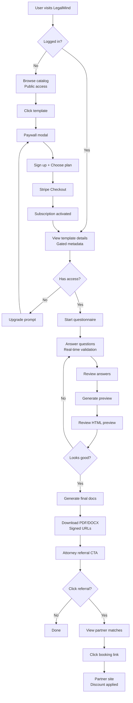
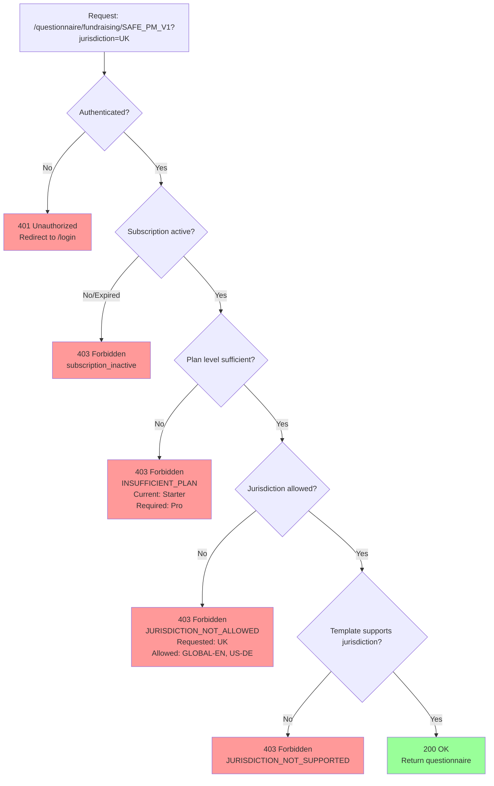

# LegalMind - System Flows & Architecture

**Version:** 1.0.0
**Date:** 2025-10-22

---

## Table of Contents

1. [User Journey Flows](#user-journey-flows)
2. [Technical Architecture](#technical-architecture)
3. [Data Flow Diagrams](#data-flow-diagrams)
4. [Security & Access Control](#security--access-control)

---

## User Journey Flows

### Flow 1: New User → Document Generation



---

### Flow 2: Paywall Decision Tree



---

### Flow 3: Template Rendering Pipeline

```
┌─────────────────────────────────────────────────────────────────┐
│                     TEMPLATE RENDERING PIPELINE                  │
└─────────────────────────────────────────────────────────────────┘

1. REQUEST
   User submits:
   {
     template_code: "SAFE_PM_V1",
     jurisdiction: "UK",
     answers: { company_name: "Acme Ltd", ... }
   }

   ↓

2. LOAD BASE TEMPLATE
   Read: packs/fundraising/templates/SAFE_PM_V1.base.json
   → Contains: clauses[], phrases[], variables_schema

   ↓

3. LOAD JURISDICTION OVERLAY
   Read: packs/fundraising/overlays/SAFE_PM_V1.UK.overlay.json
   → Contains: overrides { clauses, phrases }

   ↓

4. MERGE
   merged_template = {
     clauses: base.clauses
       .map(clause => overlay.overrides.clauses[clause.id] || clause),
     phrases: { ...base.phrases, ...overlay.overrides.phrases }
   }

   ↓

5. VALIDATE ANSWERS
   Ajv.validate(merged_template.variables_schema, answers)
   → If invalid: return 400 with errors

   ↓

6. SUBSTITUTE VARIABLES
   For each clause:
     - Replace {{variable_name}} with answers[variable_name]
     - Evaluate conditional logic: {{#if condition}}...{{/if}}
     - Apply phrase substitutions

   ↓

7. RENDER TO HTML
   markdown_to_html(clause.body_md)
   + Apply CSS styling

   ↓

8. GENERATE OUTPUTS

   For PDF:
     Puppeteer.launch()
     page.setContent(html)
     page.pdf({ format: 'A4' })

   For DOCX:
     html_to_docx(html)

   ↓

9. STORE & SIGN
   S3.upload(pdf_buffer, {
     Bucket: 'legalmind-docs',
     Key: `users/${user_id}/${audit_id}.pdf`,
     Expires: 86400 // 24 hours
   })

   signed_url = S3.getSignedUrl('getObject', { Key, Expires })

   ↓

10. AUDIT LOG
    INSERT INTO audit_log (
      audit_id,
      user_id,
      template_code,
      template_version,
      jurisdiction,
      inputs_hash,  -- SHA-256 of answers
      render_time_ms,
      output_urls,
      status
    )

   ↓

11. RETURN RESPONSE
    {
      audit_id: "aud_abc123",
      outputs: {
        pdf: "https://cdn.legalmind.tech/docs/abc123.pdf?signature=...",
        docx: "https://cdn.legalmind.tech/docs/abc123.docx?signature=..."
      },
      expires_at: "2025-10-23T23:59:59Z"
    }
```

---

### Flow 4: Attorney Referral System

```
┌───────────────────────────────────────────────────────────────────┐
│                        REFERRAL FLOW                               │
└───────────────────────────────────────────────────────────────────┘

1. TRIGGER
   User completes document generation
   → Generation success page shows referral CTA

   ↓

2. USER CLICKS "Get Attorney Review"
   POST /referral
   {
     template_code: "SAFE_PM_V1",
     jurisdiction: "UK",
     audit_id: "aud_abc123"
   }

   ↓

3. PARTNER MATCHING ALGORITHM

   partners = db.partners
     .where(jurisdiction = "UK")
     .where(status = "active")
     .where(specializations CONTAINS getCategory(template_code))
     .orderBy(rating DESC)
     .limit(3)

   // Example: template_code contains "SAFE" → category = "fundraising"

   ↓

4. GENERATE DISCOUNT TOKENS

   For each matched partner:
     referral_id = "ref_" + randomBytes(12).hex()
     token = "LM-UK-" + randomBytes(4).hex().uppercase()

     // Example: "LM-UK-A3F9"

   ↓

5. STORE REFERRAL

   INSERT INTO referrals (
     referral_id,
     user_id,
     template_code,
     jurisdiction,
     partners: [
       { partner_id, discount_token },
       ...
     ],
     expires_at: NOW() + INTERVAL '7 days',
     cta_clicked: false,
     booking_completed: false
   )

   ↓

6. RETURN PARTNER CARDS

   {
     referral_id: "ref_xyz789",
     partners: [
       {
         name: "Lex & Co Solicitors",
         jurisdiction: "UK",
         bio: "...",
         discount_percentage: 20,
         discount_token: "LM-UK-A3F9",
         booking_url: "https://lexco.com/book?ref=LM-UK-A3F9",
         rating: 4.8
       },
       // ... 2 more partners
     ],
     expires_at: "2025-10-29T23:59:59Z"
   }

   ↓

7. DISPLAY PARTNER CARDS
   User sees 1-3 attorney options with:
   - Photo
   - Name & jurisdiction
   - Specializations
   - Rating (stars)
   - "Book consultation (20% off)" button

   ↓

8. USER CLICKS PARTNER

   POST /referral/{referral_id}/cta-clicked
   { partner_id: "partner_uk_lex_co" }

   → UPDATE referrals SET cta_clicked = true
   → Track analytics event

   ↓

9. REDIRECT TO PARTNER SITE
   User redirected to:
   https://lexco.com/book?ref=LM-UK-A3F9

   → Partner site detects discount token
   → Applies 20% discount

   ↓

10. USER BOOKS CONSULTATION
    Partner confirms booking in their system

    ↓

11. PARTNER WEBHOOK
    Partner sends webhook to LegalMind:

    POST /referral/{referral_id}/booking-webhook
    Headers:
      X-API-Key: sk_partner_uk_lex_co
    Body:
      {
        partner_id: "partner_uk_lex_co",
        discount_token: "LM-UK-A3F9",
        booking_confirmed: true,
        booking_value: 500  // GBP
      }

    ↓

12. COMMISSION CALCULATION

    booking_value = 500
    commission_rate = 0.10  // 10%
    commission_amount = 500 * 0.10 = 50

    INSERT INTO commissions (
      referral_id,
      partner_id,
      booking_value: 500,
      commission_amount: 50,
      commission_paid: false
    )

    ↓

13. MONTHLY PAYOUT
    At end of month:
    - Aggregate all unpaid commissions per partner
    - Generate invoice
    - Process payout (Stripe Connect or manual)
    - UPDATE commissions SET commission_paid = true
```

---

## Technical Architecture

### System Architecture Diagram

```
┌──────────────────────────────────────────────────────────────────────┐
│                            CLIENT TIER                                │
└──────────────────────────────────────────────────────────────────────┘
                                   │
                   ┌───────────────┼───────────────┐
                   │               │               │
              [Web App]       [Mobile Web]    [Admin Panel]
             (Next.js 14)    (Responsive)    (Strapi/Sanity)
                   │               │               │
                   └───────────────┼───────────────┘
                                   │
                                   ↓
┌──────────────────────────────────────────────────────────────────────┐
│                         API GATEWAY / CDN                             │
│                  (CloudFront + API Gateway + WAF)                     │
└──────────────────────────────────────────────────────────────────────┘
                                   │
                   ┌───────────────┼───────────────┐
                   │               │               │
                   ↓               ↓               ↓
┌──────────────────────────────────────────────────────────────────────┐
│                        APPLICATION TIER                               │
│                                                                       │
│  ┌─────────────────┐  ┌──────────────────┐  ┌──────────────────┐  │
│  │   NestJS API    │  │ Rendering Worker │  │  Webhook Handler │  │
│  │  (REST/GraphQL) │  │   (Background)   │  │   (Stripe/etc)   │  │
│  └─────────────────┘  └──────────────────┘  └──────────────────┘  │
│           │                     │                      │             │
│           └─────────────────────┼──────────────────────┘             │
└──────────────────────────────────┼────────────────────────────────────┘
                                   │
                   ┌───────────────┼───────────────┐
                   │               │               │
                   ↓               ↓               ↓
┌──────────────────────────────────────────────────────────────────────┐
│                           DATA TIER                                   │
│                                                                       │
│  ┌──────────────┐  ┌─────────────┐  ┌────────────┐  ┌────────────┐│
│  │  PostgreSQL  │  │    Redis    │  │     S3     │  │ Elasticsearch│
│  │   (Primary)  │  │   (Cache)   │  │   (Docs)   │  │  (Search)   ││
│  └──────────────┘  └─────────────┘  └────────────┘  └────────────┘│
│                                                                       │
│  Users, Templates,   Session cache,  Generated docs  Template search│
│  Subscriptions,      Queue (Bull),   (signed URLs),  & analytics    │
│  Audit logs,         Autosave        CDN-backed                     │
│  Referrals                                                           │
└──────────────────────────────────────────────────────────────────────┘
                                   │
                                   ↓
┌──────────────────────────────────────────────────────────────────────┐
│                      EXTERNAL SERVICES                                │
│                                                                       │
│  ┌──────────────┐  ┌─────────────┐  ┌────────────┐  ┌────────────┐│
│  │    Stripe    │  │   SendGrid  │  │  Mixpanel  │  │   Sentry   ││
│  │  (Payments)  │  │   (Email)   │  │ (Analytics)│  │   (Logs)   ││
│  └──────────────┘  └─────────────┘  └────────────┘  └────────────┘│
└──────────────────────────────────────────────────────────────────────┘
```

---

### Database Schema (Simplified)

```sql
-- Users and Subscriptions
CREATE TABLE users (
  user_id UUID PRIMARY KEY,
  email VARCHAR(255) UNIQUE NOT NULL,
  name VARCHAR(255),
  plan VARCHAR(20) DEFAULT 'free', -- free, starter, pro, scale
  jurisdictions_allowed TEXT[], -- ['GLOBAL-EN', 'UK', ...]
  stripe_customer_id VARCHAR(255),
  stripe_subscription_id VARCHAR(255),
  subscription_status VARCHAR(50),
  subscription_start TIMESTAMP,
  subscription_end TIMESTAMP,
  generation_count INT DEFAULT 0,
  created_at TIMESTAMP DEFAULT NOW()
);

-- Templates (metadata only - content in files/CMS)
CREATE TABLE templates (
  template_code VARCHAR(50) PRIMARY KEY,
  name VARCHAR(255),
  pack VARCHAR(50),
  version VARCHAR(20),
  access_level VARCHAR(20), -- starter, pro, scale
  supported_jurisdictions TEXT[],
  status VARCHAR(20) DEFAULT 'active',
  usage_count INT DEFAULT 0,
  created_at TIMESTAMP DEFAULT NOW()
);

-- Audit Log (immutable)
CREATE TABLE audit_log (
  audit_id UUID PRIMARY KEY,
  user_id UUID REFERENCES users(user_id),
  template_code VARCHAR(50) REFERENCES templates(template_code),
  template_version VARCHAR(20),
  jurisdiction VARCHAR(10),
  inputs_hash VARCHAR(64), -- SHA-256
  render_time_ms INT,
  output_formats TEXT[], -- ['pdf', 'docx']
  output_urls JSONB,
  status VARCHAR(20), -- success, failed, partial
  error_message TEXT,
  created_at TIMESTAMP DEFAULT NOW()
);
CREATE INDEX idx_audit_user_date ON audit_log(user_id, created_at DESC);

-- Referrals
CREATE TABLE referrals (
  referral_id UUID PRIMARY KEY,
  user_id UUID REFERENCES users(user_id),
  template_code VARCHAR(50),
  jurisdiction VARCHAR(10),
  audit_id UUID REFERENCES audit_log(audit_id),
  partners JSONB, -- [{ partner_id, discount_token }, ...]
  expires_at TIMESTAMP,
  cta_clicked BOOLEAN DEFAULT false,
  cta_clicked_at TIMESTAMP,
  cta_partner_id VARCHAR(50),
  booking_completed BOOLEAN DEFAULT false,
  booking_completed_at TIMESTAMP,
  booking_value DECIMAL(10,2),
  created_at TIMESTAMP DEFAULT NOW()
);
CREATE INDEX idx_referrals_user ON referrals(user_id, created_at DESC);

-- Partners
CREATE TABLE partners (
  partner_id VARCHAR(50) PRIMARY KEY,
  name VARCHAR(255),
  jurisdiction VARCHAR(10),
  specializations TEXT[], -- ['fundraising', 'saas', ...]
  bio TEXT,
  photo_url VARCHAR(500),
  booking_url VARCHAR(500),
  discount_percentage INT,
  commission_percentage DECIMAL(5,2),
  status VARCHAR(20) DEFAULT 'active',
  rating DECIMAL(3,2),
  referral_count INT DEFAULT 0,
  created_at TIMESTAMP DEFAULT NOW()
);

-- Commissions
CREATE TABLE commissions (
  commission_id UUID PRIMARY KEY,
  referral_id UUID REFERENCES referrals(referral_id),
  partner_id VARCHAR(50) REFERENCES partners(partner_id),
  booking_value DECIMAL(10,2),
  commission_amount DECIMAL(10,2),
  commission_percentage DECIMAL(5,2),
  commission_paid BOOLEAN DEFAULT false,
  paid_at TIMESTAMP,
  created_at TIMESTAMP DEFAULT NOW()
);
```

---

## Data Flow Diagrams

### Access Control Decision Flow

```
┌─────────────────────────────────────────────────────────────────┐
│                   ACCESS CONTROL MATRIX                          │
├─────────────────────────────────────────────────────────────────┤
│                                                                  │
│  Request: GET /questionnaire/fundraising/SAFE_PM_V1?juris=UK   │
│                                                                  │
│  Step 1: Extract JWT from Authorization header                  │
│          ↓                                                       │
│  Step 2: Verify & decode JWT                                    │
│          → user_id, plan, jurisdictions_allowed                 │
│          ↓                                                       │
│  Step 3: Check subscription status (if Pro/Scale)               │
│          → Query users table: subscription_status = 'active'    │
│          ↓                                                       │
│  Step 4: Lookup template metadata                               │
│          → Query templates table: access_level = 'starter'      │
│          ↓                                                       │
│  Step 5: Check plan hierarchy                                   │
│          user.plan = 'pro' (level 2)                           │
│          template.access_level = 'starter' (level 1)           │
│          → 2 >= 1 ✓ PASS                                        │
│          ↓                                                       │
│  Step 6: Check jurisdiction entitlement                          │
│          user.jurisdictions_allowed = ['GLOBAL-EN', 'UK']       │
│          requested = 'UK'                                        │
│          → 'UK' IN jurisdictions_allowed ✓ PASS                 │
│          ↓                                                       │
│  Step 7: Check template supports jurisdiction                   │
│          template.supported_jurisdictions = [...]               │
│          → 'UK' IN supported_jurisdictions ✓ PASS               │
│          ↓                                                       │
│  ✅ ALL CHECKS PASSED → GRANT ACCESS                            │
│                                                                  │
└─────────────────────────────────────────────────────────────────┘
```

---

### Stripe Webhook Flow

```
┌──────────────────────────────────────────────────────────────────┐
│                    STRIPE WEBHOOK HANDLER                         │
└──────────────────────────────────────────────────────────────────┘

1. Stripe sends webhook:
   POST /webhooks/stripe
   Headers:
     Stripe-Signature: t=...,v1=...
   Body:
     {
       type: "checkout.session.completed",
       data: { object: { ... } }
     }

   ↓

2. Verify signature:
   const sig = req.headers['stripe-signature'];
   const event = stripe.webhooks.constructEvent(
     req.rawBody,
     sig,
     process.env.STRIPE_WEBHOOK_SECRET
   );
   → If invalid: return 400

   ↓

3. Handle event type:

   ┌─────────────────────────────────────────────────────────┐
   │  checkout.session.completed                             │
   │  → User completed Stripe Checkout                       │
   │  → Extract: customer_id, subscription_id, metadata      │
   │  → UPDATE users SET                                     │
   │      stripe_customer_id = customer_id,                  │
   │      stripe_subscription_id = subscription_id,          │
   │      plan = metadata.plan,                              │
   │      subscription_status = 'active'                     │
   │    WHERE user_id = metadata.user_id                     │
   └─────────────────────────────────────────────────────────┘

   ┌─────────────────────────────────────────────────────────┐
   │  invoice.payment_succeeded                              │
   │  → Recurring payment succeeded                          │
   │  → No action needed (subscription stays active)         │
   └─────────────────────────────────────────────────────────┘

   ┌─────────────────────────────────────────────────────────┐
   │  invoice.payment_failed                                 │
   │  → Recurring payment failed                             │
   │  → UPDATE users SET subscription_status = 'past_due'    │
   │  → Send email: "Payment failed, please update card"     │
   └─────────────────────────────────────────────────────────┘

   ┌─────────────────────────────────────────────────────────┐
   │  customer.subscription.deleted                          │
   │  → User cancelled or subscription expired               │
   │  → UPDATE users SET                                     │
   │      subscription_status = 'cancelled',                 │
   │      subscription_end = NOW()                           │
   └─────────────────────────────────────────────────────────┘

   ↓

4. Return 200 OK
   → Acknowledge receipt to Stripe
   → Stripe will retry on 5xx or timeout
```

---

## Security & Access Control

### Threat Model

| Threat | Mitigation |
|--------|-----------|
| **Unauthorized template access** | Server-side paywall checks on every request |
| **Raw template download** | Clause bodies never exposed via API |
| **User input tampering** | JSON Schema validation + server-side re-validation |
| **Session hijacking** | Short-lived JWTs (1h) + httpOnly refresh tokens |
| **CSRF** | CSRF tokens on all POST/PUT/DELETE |
| **XSS** | Content Security Policy + sanitize all user inputs |
| **SQL injection** | Parameterized queries (TypeORM/Prisma) |
| **Rate limiting bypass** | Redis-backed rate limiter (100 req/min) |
| **Stripe webhook spoofing** | Verify Stripe-Signature header |
| **Partner webhook spoofing** | API key authentication per partner |

---

### JWT Structure

```json
{
  "sub": "usr_abc123xyz",
  "email": "user@example.com",
  "plan": "pro",
  "jurisdictions_allowed": ["GLOBAL-EN", "UK", "US-DE", "DE", "FR", "CZ"],
  "iat": 1729634400,
  "exp": 1729638000
}
```

**Expiration**: 1 hour
**Refresh**: Separate refresh token (httpOnly cookie, 30 days)

---

### Rate Limiting

| Tier | Rate Limit | Burst |
|------|-----------|-------|
| **Unauthenticated** | 10 req/min | 20 |
| **Free** | 30 req/min | 60 |
| **Starter** | 60 req/min | 120 |
| **Pro** | 100 req/min | 200 |
| **Scale** | 300 req/min | 600 |

**Implementation**: Redis with sliding window counter

---

## Monitoring & Observability

### Key Metrics

**Application**:
- Request rate (by endpoint, by user plan)
- Error rate (5xx, 4xx by type)
- Response time (p50, p95, p99)
- Generation time (template rendering pipeline)

**Business**:
- New signups per day
- Conversions (free → starter, starter → pro)
- Generations per user
- Referral CTR & booking rate
- MRR growth

**Infrastructure**:
- API uptime (target: 99.5%)
- Database connections
- Redis hit rate
- S3 bandwidth
- CDN cache hit rate

**Tools**:
- **Application logs**: Winston → CloudWatch / Datadog
- **Error tracking**: Sentry
- **APM**: New Relic or Datadog APM
- **Analytics**: Mixpanel + custom dashboard

---

## Deployment Architecture

```
┌─────────────────────────────────────────────────────────────────┐
│                     PRODUCTION DEPLOYMENT                        │
└─────────────────────────────────────────────────────────────────┘

Region: eu-west-1 (Ireland) - GDPR compliant

┌───────────────────────────────────────────────────────────────┐
│  CloudFront (CDN)                                              │
│  - Global edge locations                                       │
│  - TLS 1.3, HTTP/2                                            │
│  - Cache static assets (templates metadata, images)           │
│  - DDoS protection (AWS Shield)                               │
└───────────────────────────────────────────────────────────────┘
                           │
                           ↓
┌───────────────────────────────────────────────────────────────┐
│  Application Load Balancer (ALB)                              │
│  - Health checks                                               │
│  - SSL termination                                             │
│  - Target groups for API & workers                            │
└───────────────────────────────────────────────────────────────┘
                           │
           ┌───────────────┼────────────────┐
           │                                 │
           ↓                                 ↓
┌────────────────────────┐      ┌────────────────────────┐
│  ECS Fargate (API)     │      │  ECS Fargate (Workers) │
│  - NestJS containers   │      │  - Rendering workers   │
│  - Auto-scaling: 2-10  │      │  - Bull queue          │
│  - CPU/RAM optimized   │      │  - Auto-scaling: 1-5   │
└────────────────────────┘      └────────────────────────┘
           │                                 │
           └───────────────┬─────────────────┘
                           │
           ┌───────────────┼─────────────────┐
           │               │                  │
           ↓               ↓                  ↓
┌──────────────┐  ┌──────────────┐  ┌──────────────┐
│  RDS Postgres│  │ ElastiCache  │  │  S3 Bucket   │
│  - Multi-AZ  │  │  (Redis)     │  │ + CloudFront │
│  - Encrypted │  │  - Cluster   │  │ - Signed URLs│
│  - Backups   │  │  - Encrypted │  │ - Lifecycle  │
└──────────────┘  └──────────────┘  └──────────────┘
```

**CI/CD**: GitHub Actions → Build Docker → Push to ECR → Deploy to ECS

---

**END OF SYSTEM FLOWS DOCUMENTATION**
